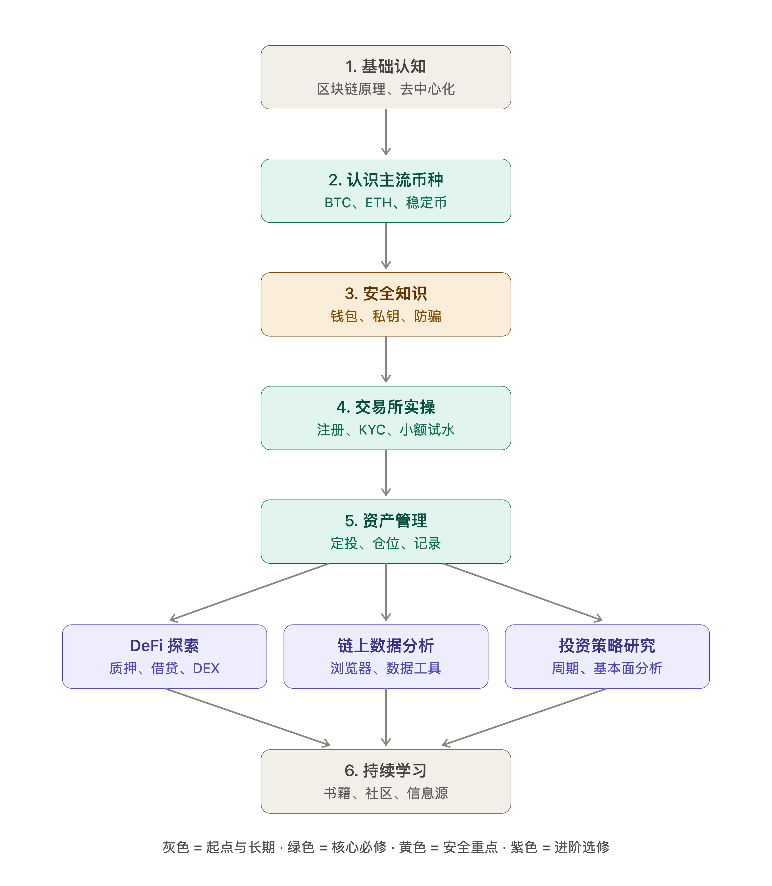

# Crypto Codex：加密货币入门学习项目

这是一个以“先理解、再安全、后实操”为原则的个人学习仓库。项目从 Claude Code 迁移到 Codex，目标是把零散对话整理成可复习、可验证、可持续维护的课程与学习记录。

> 本仓库只用于技术与风险教育，不构成投资、交易、法律或税务建议。加密资产可能大幅波动或归零；学习阶段不需要投入真实资金。

## 当前进度

| 阶段 | 主题 | 状态 | 学习材料 |
| --- | --- | --- | --- |
| 1 | 区块链基础认知 | 已完成（依据原学习记录） | [历史问答](QA.txt) |
| 2 | 认识主流币种：BTC、ETH、稳定币 | 进行中 | [第二阶段详细计划](docs/stage-02-mainstream-assets.md) |
| 3 | 安全知识：钱包、私钥、防骗 | 未开始（计划已创建） | [第三阶段详细计划](docs/stage-03-wallet-security.md) |
| 4 | 交易所实操 | 未开始 | 待创建 |
| 5 | 资产管理 | 未开始 | 待创建 |
| 6 | 进阶方向与持续学习 | 未开始 | 待创建 |

完整路径和每阶段的验收标准见[学习路线与进度](docs/roadmap.md)。



## 第二阶段怎么开始

1. 打开[第二阶段详细计划](docs/stage-02-mainstream-assets.md)。
2. 先做“课前诊断”，再完成 12 个正式课次；建议两周完成，每次 45～90 分钟。
3. 每次学习后把结论、疑问和证据写入[学习日志](docs/learning-log.md)。
4. 不买币、不连接钱包、不签名；本阶段的实操全部是阅读和区块浏览器只读观察。
5. 完成结业任务和自测后，再进入第三阶段安全知识。

第三阶段材料已经规划完成，但只有在第二阶段通过后才开始。进入时从[第三阶段详细计划](docs/stage-03-wallet-security.md)的课前诊断开始；前 8 课不连接或签名，通过安全门后先完成隔离钱包的离线演练。公共 Sepolia 收发只是可选加练，不影响通关。

## 仓库结构

```text
.
├── AGENTS.md                              # Codex 的项目级协作说明
├── CONTRIBUTING.md                       # 文档与资料贡献规则
├── QA.txt                                # Claude Code 历史对话（原始资料）
├── crypto_beginner_learning_roadmap.png  # 原始学习路线图
├── docs/
│   ├── lessons/stage-02/                 # 第二阶段各课次的详细讲义
│   ├── lessons/stage-03/                 # 第三阶段三个单元讲义
│   ├── learning-log.md                   # 学习记录模板
│   ├── roadmap.md                        # 路线、状态与阶段验收标准
│   ├── stage-02-mainstream-assets.md     # 当前阶段课程
│   └── stage-03-wallet-security.md       # 第三阶段详细计划
└── README.md
```

## 项目约定

- 优先引用协议官方文档、白皮书、监管机构或发行方披露；涉及供应量、机制、监管等会变化的信息要注明核对日期。
- 明确区分事实、项目方主张和个人推断，不用价格涨跌代替技术分析。
- 仓库中永远不要保存助记词、私钥、交易所/API 密钥、身份证明、真实账户截图或钱包备份。
- `QA.txt` 和原 PNG 是迁移档案，保留原貌；经校验的内容写入 `docs/`。

## GitHub 发布前待办

- 选择开源许可证后添加 `LICENSE`。许可证会决定他人能否复制、修改和再发布内容，因此本次不替项目所有者做法律选择。
- 在 GitHub 开启 Secret scanning（如账户/仓库支持）和私密漏洞报告。
- 首次公开前再次检查历史提交中是否包含个人信息或任何凭据。
