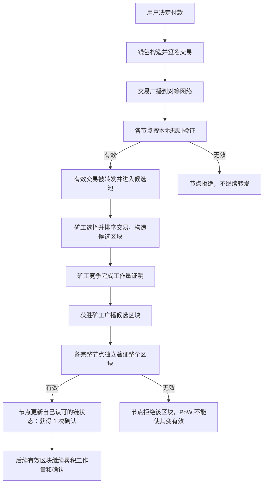

# 课次 1：BTC 的目标与价值主张

资料核对日期：2026-08-29

建议用时：60 分钟

> 本课讨论 Bitcoin 的设计目标和机制，不讨论 BTC 当前价格，也不构成投资建议。本课不需要购买 BTC、安装钱包、连接账户或签署任何交易。

## 本课要解决的问题

没有银行维护唯一总账时，数字价值怎样防止被任意复制和重复花费？

学完后，你应该能做到：

1. 区分 Bitcoin 网络、Bitcoin 协议和 BTC 资产；
2. 解释为什么数字签名本身不能彻底解决重复花费；
3. 用准确但通俗的语言解释点对点、无许可验证、抗审查和稀缺性；
4. 区分用户、钱包、完整节点和矿工的职责；
5. 说明矿工为什么不能强迫完整节点接受无效区块；
6. 解释 Bitcoin 为什么要有原生资产 BTC，同时不把用途推导成价格保证。

## 60 分钟安排

| 时间 | 内容 | 产出 |
| --- | --- | --- |
| 0～5 分钟 | 写下对核心问题的初始答案 | 一段未经查阅的直觉解释 |
| 5～18 分钟 | 数字价值与重复花费 | 能说明“复制文件”和“复制所有权”的区别 |
| 18～32 分钟 | Bitcoin、BTC 与四项价值主张 | 四个概念各写一个反例 |
| 32～43 分钟 | 用户、钱包、节点、矿工 | 完成角色边界表 |
| 43～50 分钟 | 阅读白皮书摘要和第 1～4 节 | 标出三个关键句并用自己的话转述 |
| 50～56 分钟 | 画交易进入区块的角色图 | 一张流程图 |
| 56～60 分钟 | 回答检查题和 150 字作业 | 课后输出初稿 |

## 一、问题起点：数字文件容易复制，数字价值不能重复花费

### 1. 复制信息不难，确定唯一有效历史才难

一张照片可以无限复制，因为接收者关心的是“得到一份相同信息”。数字货币不同：如果 Alice 只有一份可花费价值，她不能把同一份价值同时付给 Bob 和 Carol。

传统银行的处理方法是维护一份中心化账本：

1. Alice 发出付款指令；
2. 银行检查账户余额和交易状态；
3. 银行在自己的数据库中扣减 Alice、增加 Bob；
4. 如果 Alice 又花同一笔钱，银行以自己的账本为准拒绝第二笔。

这个办法的核心不是“纸币不能复制”，而是所有参与者接受银行记录的交易顺序和最终状态。

Bitcoin 想解决的是：没有一个大家必须信任的银行时，分散在网络各处的参与者怎样对交易历史形成一致看法。

### 2. 数字签名解决授权，但不单独解决排序

私钥签名可以证明一笔交易得到了对应密钥控制者的授权，也能让别人发现交易内容是否被修改。但是，假设 Alice 用同一份可花费输出分别签署：

- 交易 A：付给 Bob；
- 交易 B：付给 Carol。

两个签名都可能是真的。仅检查签名，无法回答哪笔交易先发生、哪笔应该被接受。因此系统还需要：

- 一份所有验证者都能检查的公开交易历史；
- 一套规则，判断交易是否引用了尚未花费的输出；
- 一种方法，在出现竞争历史时选择要继续构建的有效历史；
- 一种成本，使重写已确认历史越来越困难。

Bitcoin 把这些组件组合起来：交易签名负责授权；节点按共识规则验证；工作量证明（Proof of Work, PoW）为区块排序和历史重写增加成本；后续区块继续累积工作量，使较早的交易获得更多确认。

### 3. “不能复制 BTC”是简写，不是说数据无法复制

区块数据当然可以复制，任何完整节点都会保存或验证这些数据。真正受到限制的是：一份已经花费的交易输出，不能再次作为有效输入被完整节点接受。

所以更准确的说法是：

> Bitcoin 不阻止人复制数据，而是让网络参与者能独立验证哪次花费符合共同规则，并拒绝对同一输出的再次花费。

UTXO 的具体结构会在课次 2 展开；本课只需记住“公开历史 + 独立验证 + 排序成本”共同解决重复花费。

## 二、Bitcoin、bitcoin 与 BTC 不是同一个层次

日常写作经常混用这些词，本项目采用下面的约定：

| 写法 | 本项目中的含义 | 类比 |
| --- | --- | --- |
| Bitcoin | 整个网络、协议规则及其系统 | 电子邮件系统及其协议 |
| Bitcoin 协议 | 节点用来验证和传播交易、区块的共同规则 | SMTP 等通信规则，但这个类比并不完全对应共识 |
| bitcoin | 作为一般名称谈论这种原生数字资产 | “美元”这种资产名称 |
| BTC | 市场、钱包和界面常用的资产代码/计价符号 | USD |
| satoshi（sat） | BTC 的基础计量单位；1 BTC = 100,000,000 sat | 美元与美分，但 sat 的比例不同 |

必须避免三种混淆：

- “Bitcoin 公司发行 BTC”——Bitcoin 不是一家负责发行和承兑的公司；新 BTC 按节点执行的共识规则，通过有效区块的 coinbase 交易进入流通。
- “拥有 Bitcoin”——通常真正表达的是控制某些 BTC 对应的花费条件，而不是拥有网络或协议。
- “BTC 转账就是把文件发给别人”——交易改变的是公开账本中哪些输出仍可花费，不是把一个币文件从甲设备搬到乙设备。

大小写习惯并不是协议安全机制，不同资料也可能采用不同写法。阅读时应根据上下文判断作者说的是网络、规则还是资产。

## 三、四个常见价值主张分别是什么意思

“价值主张”是系统试图提供的能力或人们赋予它的叙事，不等于市场价格必然上涨。

### 1. 点对点电子现金（peer-to-peer electronic cash）

比特币白皮书描述的是：双方可以通过网络直接发送付款，而不必让一家金融机构成为每笔交易的可信中介。

这里的“点对点”主要表示：

- 交易通过开放的对等网络传播；
- 没有一家中央清算机构维护唯一数据库；
- 接收方可以依据协议证据验证付款，而不是只相信付款人的截图。

它不表示：

- 交易必然免费或立即最终确认；
- 每个用户都必须直接连接另一个用户的电脑；
- 使用者永远不会接触交易所、托管钱包或支付服务商；
- Bitcoin 能自动解决退款、欺诈调解和消费者保护。

如果用户把 BTC 放在托管平台，日常体验可能仍高度依赖中介。这不会改变底层网络的点对点设计，但会改变该用户实际承担的信任风险。

### 2. 无许可验证（permissionless validation）

任何具备相应设备、网络和软件条件的人，都可以运行完整节点并根据公开规则验证收到的区块和交易，不需要向银行或 Bitcoin 总部申请验证资格。

它的重要性在于：

- 验证权不只属于矿工；
- 用户可以选择亲自核验，而不是完全信任服务商展示的余额；
- 新区块即使包含大量工作量，仍必须符合节点执行的共识规则。

“无许可”不等于“零门槛”：运行节点需要存储、带宽、维护和技术能力；有效参与大规模挖矿还需要专用硬件、电力和运营资本。开放参与描述的是规则层面没有中央审批者，不是每个人的经济条件都相同。

### 3. 抗审查（censorship resistance）

抗审查意味着系统尽量减少任何单一主体永久阻止有效交易的能力。用户可以把交易传播给多个节点，矿工分布在不同主体和地区，其他矿工仍可能收录被某个矿工忽略的交易。

但抗审查是相对能力，不是绝对保证：

- 单个矿工可以选择不打包某笔交易；
- 多数算力持续协同行动时，交易可能被延迟或遭遇更强审查；
- 钱包、网络运营商、托管机构和交易所仍能在各自控制的环节限制用户；
- 手续费过低、网络连接受阻或交易本身无效，也会导致交易未被确认，这不一定属于审查；
- 法律和现实世界的强制措施不会因为协议存在而消失。

准确表述应是“没有单一协议运营者能独自批准所有交易，网络结构提高了持续审查的难度”，而不是“任何交易都保证成功”。

### 4. 稀缺性（scarcity）

BTC 的新增发行遵循公开的区块补贴和减半规则，总量上限通常概括为接近 2,100 万 BTC。完整节点会拒绝违反发行上限或凭空多造币的区块。因此矿工不能仅凭自己找到 PoW，就给自己任意数量的 BTC。

稀缺性包含三层：

1. **规则可知**：任何人都可以检查发行规则和现有交易历史；
2. **验证可执行**：完整节点独立拒绝超额发行；
3. **改变需协调**：修改软件代码不等于自动修改所有人的规则；其他节点必须选择是否采用不兼容规则。

稀缺性不表示：

- BTC 一定有需求；
- 价格只涨不跌；
- 私钥丢失的 BTC 会被协议补发；
- 交易平台显示的 BTC 债权必然有足额链上 BTC 支撑；
- 社会永远不会围绕规则变化发生争议或分叉。

有限供给是协议属性；市场价值还取决于需求、流动性、可用性、监管环境、竞争、安全预期和集体接受程度。

## 四、用户、钱包、完整节点和矿工的角色边界

现实中，一个程序或组织可以同时承担多个角色。下面是逻辑职责的区分，不代表四者必须是四台不同电脑。

| 角色 | 主要职责 | 能做什么 | 不能单独做什么 |
| --- | --- | --- | --- |
| 用户 | 决定是否付款及付款条件 | 选择接收信息、金额和可接受费用；保管或委托保管密钥 | 不能仅凭意愿让无效交易获得确认 |
| 钱包 | 管理密钥并帮助构造、签名、广播交易 | 查找可花费输出、生成签名、显示网络状态 | 不能创造协议认可的任意余额；也不代表一定做完整验证 |
| 完整节点 | 独立执行共识规则并维护自己认可的有效链状态 | 验证交易和区块、拒绝双花或超额发行、向对等节点转发有效数据 | 不负责替用户保管私钥；单个节点也不能强迫其他节点改变规则 |
| 矿工 | 组织候选区块并竞争完成 PoW | 从候选交易中选择和排序、创建有效 coinbase、广播新区块 | 不能强迫完整节点接受违反共识规则的区块 |

### 1. 用户与钱包不是一回事

用户作出经济决定，钱包是执行工具。钱包通常会：

1. 读取或查询可花费输出；
2. 根据收款信息构造交易；
3. 使用私钥产生签名；
4. 把交易广播给节点；
5. 监听交易是否进入区块及其确认情况。

钱包可能连接自己的完整节点，也可能信任第三方服务器。界面看起来相似，但验证模型和隐私风险不同。

### 2. 节点验证规则，矿工提出候选历史

可以把矿工理解为“竞争写下一页账本的人”，把完整节点理解为“逐项检查这页是否符合规则的人”。这个类比仍有局限，因为节点没有中央审批委员会，也不会通过一人一票批准区块。

当矿工广播新区块时，每个完整节点会自行检查，例如：

- 区块结构和 PoW 是否满足要求；
- 每笔交易格式和签名条件是否有效；
- 输入是否引用尚未花费的输出；
- 交易没有凭空创造额外价值；
- coinbase 领取的区块补贴和手续费没有超过规则允许值；
- 区块满足该节点执行的其他共识规则。

只有通过检查的区块，才会进入这个节点认可的有效链候选。PoW 决定在多个**有效**候选历史之间怎样比较累计工作量；它不会把无效区块“洗成有效”。

### 3. 白皮书中的“节点”与现代常用角色划分

白皮书第 5 节使用“节点”描述收集交易、执行 PoW、广播和验证的一组参与者。现代 Bitcoin 生态中，通常把“完整验证节点”和“矿工”分开描述，因为很多完整节点不挖矿，矿池和矿工也常依赖独立节点或挖矿基础设施。

阅读历史资料时，不要机械地把每一个 `node` 都翻译成今天语境中的同一种软件角色；应看它在该段承担的是验证、传播还是挖矿职责。

## 五、一笔交易怎样从意图变成较难逆转的记录



要注意三个细节：

- 交易先被节点接受和传播，不代表它一定会被矿工收录；
- 进入一个区块后获得首次确认，后续区块使重组这段历史需要付出更多工作；
- “更多确认”不是更多银行盖章，而是该交易所在区块之后累积了更多有效 PoW 历史。

## 六、Bitcoin 为什么需要原生资产 BTC

可以从三个互相连接的角度理解。

### 1. 它是账本原生的价值单位

Bitcoin 需要定义交易到底转移什么。BTC/sat 是协议直接识别的计量单位，花费条件和交易费用都用它表达，不依赖另一个银行数据库确认余额。

### 2. 它为开放网络提供原生激励

矿工需要承担硬件、电力和运营成本。有效区块允许矿工按规则领取区块补贴和交易费：

- 区块补贴按预定规则发行新 BTC，帮助系统在没有中央发行者的情况下启动安全预算和分发资产；
- 交易费由用户在交易中提供，让稀缺的区块空间形成价格，并在区块补贴逐步下降时继续激励矿工。

如果奖励必须由某家银行用外部货币支付，系统就会重新依赖这个付款者及其账户体系。

### 3. 它把攻击成本、奖励和网络使用连接起来

矿工通过遵守规则竞争协议认可的 BTC 奖励；构造无效区块会浪费已经付出的 PoW 成本，因为完整节点会拒绝它。这里的关键不是矿工“善良”，而是有效奖励与规则遵守相联系。

但是，协议只能定义 BTC 的发行和使用方式，不能命令市场赋予 BTC 某个价格。如果需求、信任或使用消失，稀缺本身也不能保证价值。

## 七、“数字黄金”是什么，不是什么

“数字黄金”是对 BTC 某些特征的类比和市场叙事，常见依据包括：

- 供应规则公开且上限明确；
- 可验证、可分割、可跨网络转移；
- 不依赖单一发行机构承诺兑付；
- 获取新供应需要付出资源成本。

这个类比有助于快速理解，但不能当成等式：

| 维度 | 黄金 | BTC |
| --- | --- | --- |
| 形态 | 实物资产 | 由协议状态和密钥控制的原生数字资产 |
| 历史 | 数千年社会使用历史 | 2009 年开始运行的网络 |
| 供应 | 地质储量和开采经济决定，无法精确预知 | 共识规则给出可计算的发行路径和上限 |
| 验证 | 需要物理检测和保管 | 可通过节点和密码学数据验证 |
| 主要风险 | 鉴定、运输、保管、没收等 | 密钥、软件、网络、托管、监管、市场等 |

因此，“有人把 BTC 称作数字黄金”是可观察的叙事；“BTC 必然像黄金一样保值”是未经协议保证的推断；“所以价格一定上涨”则是错误跳跃。

## 八、白皮书阅读指南

本课阅读[比特币白皮书](https://bitcoin.org/bitcoin.pdf)的摘要和第 1～4 节，不要求一次读懂数学部分。官方英文版把 Introduction 编为第 1 节，后面依次是第 2 节 Transactions、第 3 节 Timestamp Server、第 4 节 Proof-of-Work；原计划中“摘要、引言和第 1～3 节”的写法会重复计算引言并漏掉 PoW，因此在这里按原文编号修正。

### 摘要：寻找四个答案

- 系统想绕开什么可信第三方？
- 数字签名已经解决了什么？
- 还剩下哪个重复花费问题？
- 工作量证明链为历史记录增加了什么性质？

### 第 1 节 Introduction：区分目标与代价

注意作者为什么认为可逆支付需要中介和信任。不要由此推出“所有不可逆支付都更好”：消费者保护、争议处理和操作失误恢复是另一组真实需求。

### 第 2 节 Transactions：看懂授权链的局限

重点不是背图，而是理解：签名能验证所有权转移授权，却需要一个公开方法确定哪次花费先被网络接受。

### 第 3 节 Timestamp Server：看懂公开排序

每批数据的哈希包含在时间戳记录中，后一个记录引用前一个记录，使修改旧内容会影响后续链接。这建立可检查的顺序，但第 3 节之前还没有解释谁有权廉价创建大量竞争历史。

### 第 4 节 Proof-of-Work：看懂重写成本

PoW 要求产生新区块付出可量化计算工作，验证结果却相对容易。修改旧区块还需要重做其后的工作，并追上诚实网络继续增长的链。

### 阅读时的历史语境提醒

白皮书是 2008 年的设计文档，不是当前所有实现细节的完整操作手册。理解设计动机以白皮书为主；了解现代节点、钱包和共识验证行为，还要对照 Bitcoin Core 和 Developer Guide。

## 九、本课任务

### 任务 1：四个概念各写一句“是什么”和“不是什么”

| 概念 | 是什么 | 不是什么 |
| --- | --- | --- |
| 点对点电子现金 |  |  |
| 无许可验证 |  |  |
| 抗审查 |  |  |
| 稀缺性 |  |  |

如果一句话中出现“一定、完全、永远、零风险”，优先检查是否说得过头。

### 任务 2：重画角色图

不要直接复制本讲义的 Mermaid 图。合上文件后凭记忆画出：

```text
用户意图 → 钱包签名 → 节点验证/传播 → 矿工选取与 PoW
        → 节点验证新区块 → 后续有效区块增加确认
```

必须另外画出两条失败分支：无效交易在哪里被拒绝，无效区块在哪里被拒绝。

### 任务 3：用约 150 字解释为什么需要 BTC

答案至少包含三个要点：

1. BTC 是 Bitcoin 账本原生的价值和费用单位；
2. 区块补贴与交易费在没有中央付款者时激励矿工；
3. 协议用途和稀缺性不等于价格必涨。

写作框架：

```text
Bitcoin 若没有原生资产，就难以……
BTC 在协议中首先承担……
区块补贴……，交易费……
这使开放网络可以……而不依赖……
但这些机制只说明……，不能保证……
```

不要把参考框架逐字拼接；先口头讲清楚，再写成自己的版本。

## 十、检查问题

### 问题 1

矿工能否随意把无效交易写入并让所有完整节点接受？为什么？

<details>
<summary>先独立回答，再展开核对</summary>

不能。矿工可以构造并广播候选区块，但每个完整节点都会独立执行共识规则。双花、无效签名、超额发行或其他违反规则的内容会使区块被节点拒绝。矿工即使为该区块完成了 PoW，也不能把无效内容变成有效，只会损失相应成本。需要注意：矿工对有效交易的选择和排序有一定权力，也可能暂时不收录某笔交易；这与强迫节点接受无效交易不是一回事。

</details>

### 问题 2

如果 Alice 为同一份可花费输出签了两笔收款人不同的交易，为什么“两个签名都有效”仍不代表“两笔付款都有效”？

### 问题 3

“任何人都能运行完整节点”与“任何人都能低成本、有利润地挖矿”有什么区别？

### 问题 4

分别举一个例子说明：交易没有确认可能是审查，也可能只是无效、费用或网络传播问题。

### 问题 5

把以下四句话标记为“协议事实 / 观察或叙事 / 无法由协议保证”：

1. 完整节点会拒绝违反其共识规则的区块。
2. BTC 常被一些市场参与者称为“数字黄金”。
3. BTC 的稀缺性保证它以法币计价长期上涨。
4. 矿工可在候选有效交易中进行选择和排序。

## 十一、本课常见误区

- **误区：矿工就是记账银行。** 矿工竞争提出区块，但完整节点独立验证；矿工不能单方面改写节点接受的规则。
- **误区：PoW 证明区块中的一切都有效。** PoW 证明付出了工作，交易和区块内容仍需按共识规则验证。
- **误区：钱包负责确认交易有效。** 钱包负责密钥和交易构造，但并非所有钱包都执行完整节点级验证。
- **误区：广播等于到账。** 广播、进入节点候选池、被矿工收录、获得确认是不同阶段。
- **误区：去中心化等于没有中介。** 底层协议没有单一清算者，但用户仍可能主动使用托管和支付中介。
- **误区：抗审查等于任何交易必然确认。** 无效、低费、网络故障和协同审查都可能导致未确认，原因需要区分。
- **误区：供应有限等于价格有下限。** 供应规则不创造需求，也不提供收益保证。
- **误区：“数字黄金”是协议定义。** 它是解释和评价 BTC 的类比，不是共识规则。

## 十二、完成标准

只有以下项目都完成，才在学习日志中把课次 1 标为完成：

- [ ] 不看资料说清 Bitcoin 与 BTC 的区别；
- [ ] 解释签名为什么不能单独解决重复花费；
- [ ] 为四项价值主张各写一个边界或反例；
- [ ] 准确区分用户、钱包、完整节点和矿工；
- [ ] 画出包含两条拒绝分支的角色图；
- [ ] 独立完成约 150 字作业；
- [ ] 正确回答“矿工能否强迫完整节点接受无效区块”；
- [ ] 在日志中记录一个仍然不确定的问题和对应的一手资料链接。

完成这些任务前，不修改 [`../../learning-log.md`](../../learning-log.md) 中的课次状态。

## 十三、一手资料

- [Bitcoin: A Peer-to-Peer Electronic Cash System](https://bitcoin.org/bitcoin.pdf)：摘要和第 1～5 节支持重复花费、时间戳、PoW、网络传播和节点验证的设计解释。
- [Bitcoin Developer Guide：Block Chain](https://developer.bitcoin.org/devguide/block_chain.html)：完整节点独立验证、共识规则、交易输出与双花。
- [Bitcoin Developer Guide：P2P Network](https://developer.bitcoin.org/devguide/p2p_network.html)：完整节点对区块和交易的下载、验证与传播。
- [Bitcoin Developer Guide：Wallets](https://developer.bitcoin.org/devguide/wallets.html)：钱包的密钥、签名、网络和广播职责。
- [Bitcoin Core：Validation](https://bitcoin.org/en/bitcoin-core/features/validation)：为什么完整验证会拒绝矿工创建的无效或超额发行区块。
- [Bitcoin.org：Halving](https://bitcoin.org/en/halving)：发行节奏、减半和 2,100 万上限的概览。涉及当前区块高度或下一次减半日期时，应重新实时核对。

说明：白皮书是原始设计文档；Developer Guide、Bitcoin Core 功能页和 Bitcoin.org 教育页用于补充现代角色划分与实现行为。站点中的价值判断不能替代协议事实或独立风险分析。
