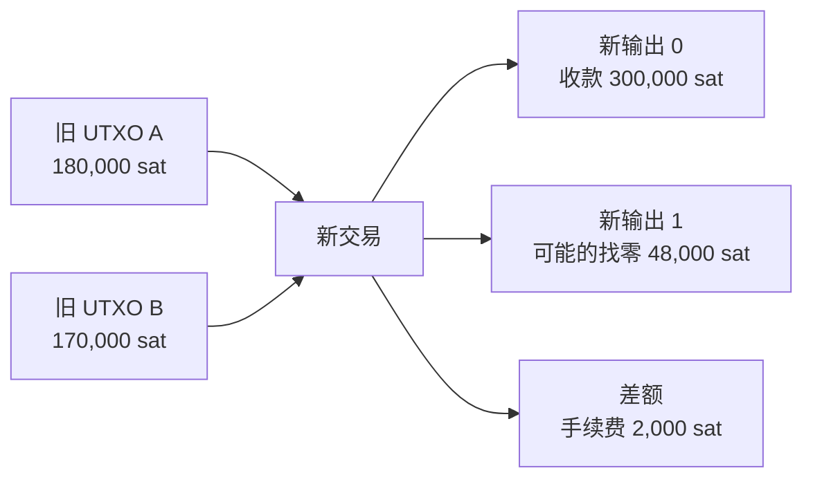

# 课次 2：BTC 的 UTXO 与交易

资料核对日期：2026-08-29

建议用时：75 分钟

> 本课只观察公开交易，不购买 BTC、不安装或连接钱包、不签名，也不查询自己的地址或交易。区块浏览器是第三方观察工具，其标签可能是推断，不等于协议事实。

## 本课要解决的问题

钱包显示的“余额”在链上实际是什么？

学完后，你应该能做到：

1. 解释未花费交易输出（Unspent Transaction Output, UTXO）是什么；
2. 说明一笔普通交易怎样消费旧输出并创建新输出；
3. 使用输入总额、输出总额计算交易手续费；
4. 解释找零为什么出现，以及为什么旁观者通常不能确定哪个输出是找零；
5. 区分交易 ID、输出序号、区块高度和确认数；
6. 说明地址为什么不是账户，钱包为什么不是装币的容器；
7. 使用虚拟大小（vsize）和费率理解费用，而不是按转账金额百分比理解；
8. 在不接触自己账户的前提下，只读拆解一笔公开的已确认交易。

## 75 分钟安排

| 时间 | 内容 | 产出 |
| --- | --- | --- |
| 0～5 分钟 | 写下“余额存在哪里”的直觉答案 | 一段课前答案 |
| 5～22 分钟 | UTXO、输入、输出与交易守恒关系 | 一张交易状态图 |
| 22～34 分钟 | 找零与币选择 | 能解释为什么找零不是交易退款 |
| 34～45 分钟 | TXID、区块高度和确认数 | 完成四个标识的对照表 |
| 45～56 分钟 | 地址、钱包与余额显示 | 修正“地址就是账户”的误解 |
| 56～66 分钟 | 总手续费、vsize 与费率 | 独立完成一次费用计算 |
| 66～73 分钟 | 区块浏览器只读练习 | 一份不含个人地址的交易记录 |
| 73～75 分钟 | 纸币找零类比与检查题 | 课后输出初稿 |

## 一、先换掉“账户余额”思维

在银行账户模型中，可以想象数据库里有一行：

```text
Alice 的余额 = 800,000 sat
```

Bitcoin 的链上状态不是这样保存的。它记录一笔笔交易；每笔普通交易消费以前创建的输出，并创建新的输出。尚未被后续交易消费的输出，就是 UTXO。

钱包所说的“余额”，通常是它识别出的、满足特定确认和可用条件的 UTXO 金额之和：

```text
钱包可用余额 ≈ Σ（钱包当前能够花费且满足钱包策略的 UTXO）
```

这里故意使用“约等于”，因为钱包可能把余额分成：

- 已确认与未确认；
- 可立即花费与暂时锁定；
- 自己能签名花费与仅监视（watch-only）；
- 安全可用与存在替换、未确认父交易等风险的输出；
- 未成熟的 coinbase 输出与普通输出。

所以，同一组链上数据在不同钱包策略下，界面显示的“可用余额”可能不同。

## 二、UTXO 到底是什么

### 1. 一个输出包含什么

简化地说，一个交易输出（transaction output）至少包含：

- **金额**：以 satoshi 为最小链上计量单位；
- **锁定条件**：输出脚本（`scriptPubKey`），规定以后花费该输出需要满足什么条件；
- **输出序号**：在本交易输出数组中的位置，从 `0` 开始，常称 `vout`。

某些标准输出脚本可以显示成常见 Bitcoin 地址，但不是每种输出都一定有单一、明确的地址表示。

当这个输出尚未被任何有效链上交易作为输入消费时，它就是 UTXO。一旦被消费，它仍保留在历史交易中，但不再属于当前 UTXO 集合，也不能再次有效花费。

### 2. 怎样唯一指向一个 UTXO

只写“交易 ID”不够，因为一笔交易可以有多个输出。一个具体输出由下面二元组标识：

```text
outpoint = TXID : vout
```

例如，`某交易的 TXID : 1` 表示该交易中编号为 1 的输出。这里不用真实 TXID，是为了把注意力放在结构而不是复制链上标识。

### 3. 输入做什么

普通交易输入（transaction input）会：

1. 引用一个以前的 outpoint；
2. 提供满足该输出锁定条件所需的数据，例如签名、公钥或 witness 数据；
3. 使被引用的 UTXO 在交易确认后成为已花费输出。

输入不是从地址账户中“减去一个数字”，而是消费一个完整的旧输出。一个 UTXO 不能只花一部分；如果不需要把全部金额付给收款人，剩余价值通常要通过新输出返回给付款方。

### 4. 交易消费旧输出，原子地创建新输出



交易被确认后：

- 旧 UTXO A 和 B 都被完整消费；
- 输出 0 和输出 1 成为两个新的 UTXO；
- 2,000 sat 不会成为普通输出，而由包含该交易的矿工通过区块奖励机制取得；
- 整个状态变更要么作为有效交易成立，要么不成立，不会只消费输入却不创建已签名的输出。

### 5. 普通交易的价值关系

忽略创建新币的 coinbase 交易，普通交易必须满足：

```text
输入总额 ≥ 输出总额
总手续费 = 输入总额 − 输出总额
```

若输出总额大于输入总额，交易凭空创造了额外价值，完整节点会判定它无效。

coinbase 是每个区块中的特殊交易，不引用普通旧 UTXO，可以按共识规则领取允许的区块补贴和本区块手续费。本课的浏览器练习应避开 coinbase，因为它不适合学习普通输入结构。

## 三、找零不是“退回原来那枚币”

### 1. 为什么会有找零

假设钱包只有两个 UTXO：

| UTXO | 金额 |
| --- | ---: |
| A | 180,000 sat |
| B | 170,000 sat |

用户要支付 300,000 sat，钱包预计总手续费为 2,000 sat。单个 UTXO 都不够，钱包必须选择 A 和 B，并处理全部 350,000 sat：

| 新输出或费用 | 金额 |
| --- | ---: |
| 给收款人的输出 | 300,000 sat |
| 返回付款方控制的新找零输出 | 48,000 sat |
| 总手续费 | 2,000 sat |
| 合计 | 350,000 sat |

找零输出不是把原 UTXO 切下一角后原样退回。A 和 B 已经消失于当前 UTXO 集；48,000 sat 是这笔交易新创建的 UTXO。

### 2. 钱包为什么不一定选择“刚好够”的 UTXO

钱包的币选择（coin selection）会考虑：

- 当前有哪些 UTXO；
- 目标金额和预计手续费；
- 输入数量对交易体积和费用的影响；
- 是否产生过小或不经济的找零；
- 隐私、地址复用、未确认输入和钱包自身策略。

因此，两个钱包面对相同余额，也可能选择不同输入、产生不同找零和不同费用。

### 3. 为什么区块浏览器通常不能确定找零

链上输出没有一个名为 `is_change` 的公开字段。对外部观察者来说，交易只公开输入、输出、脚本、金额等数据。浏览器可能依据下面的启发式做标签：

- 两个输出中，一个金额像付款，另一个像余数；
- 某输出使用了看起来较新的地址或与输入相似的脚本类型；
- 已知实体或地址簇提供了额外上下文。

这些都不是证明。下面的交易会破坏简单猜测：

- 一次给多个收款人的批量付款；
- 没有找零、刚好花完的交易；
- 自己整理 UTXO 的自转交易；
- 多方协作、输入输出很多的 CoinJoin 类交易；
- 付款方故意选择特殊金额或不同脚本类型；
- 找零后来被另一个钱包或服务处理。

因此练习中应写“输出 1 **可能**是找零，依据是……，置信度低/中/高”，不能写“浏览器证明输出 1 是找零”。只有钱包自身的密钥、描述符和交易元数据通常能给付款方更可靠的判断。

## 四、TXID、区块高度和确认数分别回答什么

### 1. 交易 ID（TXID）

TXID 是由交易序列化数据计算得到的哈希标识，浏览器通常显示为 64 个十六进制字符。它用于：

- 查找和引用一笔交易；
- 与 `vout` 一起指向具体旧输出；
- 在公开工具中核对交易是否出现于某个区块。

TXID 不是：

- 钱包地址；
- 私钥或密码；
- 区块高度；
- 单独证明交易已确认的凭证。

进阶提醒：对 SegWit 交易，Bitcoin Core 还返回包含 witness 数据的交易哈希，通常称 `wtxid`；它可能与 `txid` 不同。本课记录浏览器标为 TXID 的字段即可，不需要手算。

### 2. 区块高度（block height）

区块高度表示一个区块在链中的位置，创世区块高度为 0。交易被收录后，可以记录其所在区块的高度。

高度不是时间戳，也不是区块哈希：

- 不同竞争链尖端在短时间内可能出现同一高度的不同区块；
- 区块哈希标识具体区块；
- 高度描述它位于第几个位置；
- 区块时间由矿工写入并受协议规则约束，但不等同于精确现实世界到账时间。

### 3. 确认数（confirmations）

一笔交易进入当前有效链尖端的区块时，通常记作 1 次确认；此后每增加一个建立在其后的有效区块，确认数增加 1。

如果当前链尖端高度为 `H_tip`，交易所在区块高度为 `H_tx`，可用下面的常见计算：

```text
确认数 = H_tip − H_tx + 1
```

假设链尖端高度是 900,000，交易位于 899,998：

```text
900,000 − 899,998 + 1 = 3 次确认
```

这是纯教学数字，不代表当前真实区块高度。

确认数表达的是重组这笔交易所在历史需要替换多少层已累积的有效 PoW。更多确认通常降低被链重组替换的概率，但不是法律最终性或绝对数学保证。

未进入区块的交易通常显示 0 次确认或 `unconfirmed`。它可能仍在某些节点的内存池，也可能被替换、丢弃、与双花冲突，或从未被你查询的节点看到。

## 五、地址不是账户，钱包也不是装币的容器

### 1. 地址更像付款条件的便捷编码

常见 Bitcoin 地址是某类输出脚本或其组成数据的人类可用编码，用来告诉付款钱包如何创建锁定条件。它不是协议中的银行账户对象：

- 一个地址可以先后收到多个独立 UTXO；
- 一个 UTXO 由 `TXID:vout` 标识，不由“地址余额”标识；
- 某些输出脚本没有单一标准地址；
- 花费时消费的是具体 UTXO，不是从地址记录中扣余额；
- 浏览器显示的“地址余额”是对相关未花费输出的派生汇总。

出于隐私和可识别性考虑，钱包通常会生成多个收款和找零地址。把同一地址反复当成固定银行账号使用，会让外部观察者更容易关联交易。

### 2. 钱包管理控制能力和元数据

自托管钱包通常负责：

- 管理或调用用于签名的密钥；
- 维护地址、脚本描述符和交易标签等元数据；
- 识别哪些 UTXO 可由相应条件花费；
- 选择输入、创建收款与找零输出；
- 估算费用、签名和广播交易；
- 根据自己的节点或第三方服务显示确认状态。

BTC 并没有作为文件“装在”手机或硬件钱包里。链上记录存在于 Bitcoin 网络状态中；钱包保存的是控制和识别这些输出所需的信息。

如果设备损坏但安全备份仍能恢复正确密钥和描述信息，钱包可以重新扫描链上历史并重建余额。反过来，只有链上地址而没有满足花费条件所需的密钥，并不代表能够花费这些 UTXO。

### 3. 托管平台显示的余额是另一层账本

交易所或托管服务的账户余额，可能首先是服务商内部数据库里的对用户负债，并不意味着链上存在一个只属于该用户的对应地址或 UTXO。只有服务商实际发起链上提现时，才会创建 Bitcoin 网络上的交易。

因此要区分：

- 钱包从链上 UTXO 推导的余额；
- 自托管钱包由谁控制密钥；
- 托管平台内部账户显示的债权余额。

## 六、手续费为什么不按转账金额百分比计算

### 1. 总手续费来自输入与输出的差额

对普通交易：

```text
总手续费（sat）= 所有输入引用的旧输出总额 − 所有新输出总额
```

Bitcoin 交易没有一个必填的“手续费输出”。这部分差额成为矿工可以在 coinbase 交易中领取的本区块手续费。

### 2. 现代常用费率单位是 sat/vB

SegWit 引入交易权重（weight）后，现代钱包和浏览器通常使用虚拟字节（virtual byte, vB）比较交易占用的区块资源：

```text
虚拟大小 vsize = 向上取整(weight / 4)
费用率 feerate = 总手续费 sat / vsize vB
总手续费 ≈ 费用率 × vsize
```

之所以写“约等于”，是因为界面显示可能经过四舍五入；用完整整数 sat 和 vsize 计算应能对应实际差额。

单位必须先看清：

- 浏览器常用 `sat/vB`；
- Bitcoin Core `estimatesmartfee` RPC 返回 `BTC/kvB`；
- `sat/B`、`sat/vB`、`BTC/kB` 和 `BTC/kvB` 不能直接把数字互抄。

### 3. 哪些因素增加交易 vsize

主要因素包括：

- 输入数量：花费更多 UTXO 通常需要更多引用和解锁/witness 数据；
- 输出数量：更多收款人和找零输出需要更多数据；
- 使用的脚本类型和签名条件；
- 是否包含额外数据；
- witness 数据在权重计算中获得不同权重，但不是完全免费。

一个输入、两个输出的大额交易，可能比十个输入、三个输出的小额交易更小。因此转 1 BTC 不必然比转 0.001 BTC 贵。

### 4. 区块空间需求怎样影响费率

用户或钱包选择愿意支付的费率，矿工通常更偏好能提高区块总收益的交易或交易包。网络待确认交易很多、大家竞争相同区块空间时，获得较快确认所需的市场费率可能上升；需求低时可能下降。

但高费率不是协议保证的确认时间，低费率也不等于交易无效。交易能否被节点转发还涉及各节点策略，能否被矿工收录涉及矿工选择、祖先交易、交易包和其他策略。本课只需要掌握“资源大小 × 竞争费率”的核心模型。

### 5. 完整计算示例

继续使用前面的教学交易：

```text
输入总额        = 350,000 sat
输出总额        = 300,000 + 48,000 = 348,000 sat
总手续费        = 350,000 − 348,000 = 2,000 sat
假设 vsize      = 200 vB
实际费用率      = 2,000 / 200 = 10 sat/vB
```

若发送金额改成 400,000 sat，但输入数量、输出数量、脚本类型和 vsize 仍相同，钱包可以调整找零而保持相同总手续费。金额不是主要的空间成本变量。

## 七、只读区块浏览器练习

### 1. 安全边界

本练习只使用公开交易：

- 不登录任何账户；
- 不连接钱包，不点击 `Connect Wallet`、`Send`、`Sign` 或类似按钮；
- 不粘贴自己的地址、TXID、交易所充值地址或截图；
- 不安装浏览器扩展；
- 不把浏览器标签当成协议证明；
- 认识到第三方站点可能记录 IP、浏览行为和搜索内容。

可以使用：

- [mempool.space 的区块列表](https://mempool.space/blocks)
- [Blockstream Explorer](https://blockstream.info/)

这两个都是第三方浏览器，不是 Bitcoin 共识的一部分。核心字段最好在两个浏览器间交叉核对；如果显示不同，记录差异，不要猜测谁必然正确。

### 2. 选择一笔适合学习的交易

1. 打开最近的一个已确认区块；
2. 跳过交易列表中的第一笔 coinbase 交易；
3. 选择一笔结构相对简单的普通交易，例如 1～3 个输入、2 个输出；
4. 确认页面显示交易已进入区块；
5. 不选择任何与你本人、朋友或真实账户有关的交易。

选择两个输出只是为了便于练习找零推断，不表示“两个输出必定一收款一找零”。

### 3. 在日志中记录

把下面模板复制到 [`../../learning-log.md`](../../learning-log.md) 末尾。TXID 和区块数据本身是公开信息，可以记录；不要记录任何自己的地址。

```markdown
### YYYY-MM-DD｜课次 2：公开 BTC 交易只读拆解

- 核对时间及时区：
- 浏览器 1：
- 浏览器 2（交叉核对）：
- 交易 ID（TXID）：
- 状态：已确认 / 未确认
- 所在区块高度：
- 观察时确认数：
- 输入数量：
- 输入总额：
- 输出数量：
- 输出总额：
- 总手续费（输入总额 − 输出总额）：
- 虚拟大小（vsize）：
- 自己计算的费用率（总手续费 / vsize）：
- 浏览器显示的费用率及单位：
- 可能的找零输出：输出 #__ / 无法判断
- 找零判断依据：
- 找零判断置信度：低 / 中 / 高
- 两个浏览器是否一致：
- 我仍不理解的字段：
```

### 4. 核对顺序

按下面顺序检查，避免被界面标签带着走：

1. 数 `vin`/inputs 和 `vout`/outputs 的数量；
2. 计算或核对输入总额；
3. 计算或核对输出总额；
4. 用差额独立算总手续费；
5. 用总手续费除以 vsize，核对 `sat/vB`；
6. 记录区块高度和当时确认数；
7. 最后才推测找零，并明确它只是推断；
8. 用第二个浏览器交叉核对原始字段。

如果浏览器不显示输入所引用旧输出的金额，换用能展开 prevout 的浏览器，或只记录“该字段无法从当前工具核对”，不要编造数字。

## 八、用纸币找零类比 UTXO

### 1. 类比有用的部分

假设你只有一张 100 元纸币，要买 37 元商品：

- 你不能只把原纸币的一角剪下来；
- 你把整张 100 元交出；
- 商家收到 37 元价值；
- 你得到 63 元找零。

对应到 UTXO：

- 100 元纸币类似被选择的旧 UTXO；
- 支付时旧 UTXO 被完整消费；
- 37 元类似给收款人的新输出；
- 63 元类似回到付款方控制的新找零输出。

若加入 Bitcoin 手续费，例子会变成 37 元给商家、62 元作为找零、1 元作为手续费。

### 2. 类比不准确的部分

必须补充这些限制：

- UTXO 不是物理纸币，而是公开交易状态中的离散输出；
- 纸币由占有实物控制，UTXO 由能否满足脚本条件决定；
- 一笔 Bitcoin 交易可以同时消费多个 UTXO、创建多个收款输出；
- 找零不是原 UTXO 的同一物件，而是新交易创建的新输出；
- Bitcoin 交易公开可追踪，现金交付通常没有同样的公共历史；
- 手续费不是固定面额，而与交易 vsize、所选费率和区块空间竞争相关；
- 外部观察者不一定知道哪个输出是收款、哪个是找零。

### 3. 输出写作框架

```text
UTXO 像钱包里的不同面额纸币，因为……
付款时，钱包会选择……，并把它们完整消费。
新交易创建……和可能的找零输出，手续费等于……
但这个类比不完全准确，因为 UTXO 并不是……，
而且链上旁观者通常不能确定……
```

先独立写 150～250 字，再展开下面的参考答案核对，不要直接复制。

<details>
<summary>参考答案</summary>

UTXO 可以暂时类比成钱包里的不同面额纸币：付款时，钱包选择一张或多张足够支付的“纸币”，旧 UTXO 会被完整消费，交易再创建给收款人的新输出和可能返回付款方的新找零输出，输入与输出的差额就是手续费。但 UTXO 并不是物理纸币，而是链上由交易 ID、输出序号、金额和脚本条件定义的状态；它可以组合成多输入、多输出交易，控制权取决于能否满足脚本。链上也没有公开的“找零”标签，旁观者通常只能推测。

</details>

## 九、检查问题

### 问题 1

一个钱包有三个可用 UTXO：100,000、250,000、400,000 sat。为什么不能只说它“有一个 750,000 sat 的链上账户余额”？

### 问题 2

某普通交易输入总额为 1,200,000 sat，三个输出分别是 500,000、400,000、285,000 sat。总手续费是多少？

### 问题 3

两个输出中金额较小的那个一定是找零吗？为什么？

### 问题 4

当前链尖端高度为 900,010，一笔交易位于高度 900,008。按常见算法它有多少次确认？

### 问题 5

两笔交易的转账金额分别为 1 BTC 和 0.001 BTC。为什么前者可能支付更低的总手续费？

### 问题 6

TXID 与 `TXID:vout` 分别标识什么？

### 问题 7

为什么交易所账户里显示 0.5 BTC，不一定代表链上存在一个只属于该用户、恰好为 0.5 BTC 的 UTXO？

<details>
<summary>完成后展开答案要点</summary>

1. 链上存在三个可独立消费的输出；750,000 sat 是钱包派生的求和结果，币选择和费用取决于消费哪些 UTXO。
2. `1,200,000 − (500,000 + 400,000 + 285,000) = 15,000 sat`。
3. 不一定。交易可能是批量付款、自转、CoinJoin 或无找零交易；链上没有公开找零字段。
4. `900,010 − 900,008 + 1 = 3` 次确认。
5. 费用主要受输入/输出数量、脚本类型、vsize 和选择的费率影响，而不是转账金额本身。
6. TXID 标识整笔交易；`TXID:vout` 标识该交易中的一个具体输出。
7. 托管平台余额通常首先是平台内部账本对用户的负债，平台可以归集用户资金并用自己的多个 UTXO统一完成链上充提。

</details>

## 十、本课常见误区

- **误区：UTXO 是一个地址。** UTXO 由具体交易 ID 和输出序号标识；地址只是部分输出条件的便捷编码。
- **误区：钱包余额存在某个区块里的一行账户记录。** 钱包通过识别和汇总可花费输出得到余额。
- **误区：交易把旧 UTXO 改小。** 旧 UTXO 被完整消费，找零是新输出。
- **误区：两个输出一定是一笔付款加一笔找零。** 批量付款、多方交易和自转都会破坏这个假设。
- **误区：浏览器的找零标签是链上字段。** 它通常是启发式推断，应记录依据和置信度。
- **误区：TXID 就是收款地址。** TXID 标识交易；地址用于构造某类输出条件。
- **误区：0 次确认等于交易无效。** 它可能有效但尚未进入区块，也可能冲突、被替换或未传播。
- **误区：6 次确认是协议规定的绝对最终性。** 确认数是风险度量；需要多少确认取决于威胁模型，协议没有统一的绝对安全门槛。
- **误区：手续费是转账金额的百分比。** 它是输入输出差额，市场通常用 sat/vB 比较区块资源竞争。
- **误区：钱包里真的装着 BTC 文件。** 钱包管理密钥和识别信息，链上状态由网络验证和保存。
- **误区：手续费高就保证下一个区块确认。** 较高费率通常提高竞争力，但不构成协议保证。

## 十一、完成标准

只有以下项目都完成，才在学习日志中把课次 2 标为完成：

- [ ] 不看资料画出“旧 UTXO → 输入 → 新交易 → 新输出”的过程；
- [ ] 能用 `输入总额 − 输出总额` 独立计算手续费；
- [ ] 能解释为什么找零是新 UTXO；
- [ ] 能区分 TXID、vout、区块高度和确认数；
- [ ] 能解释地址余额为什么是派生汇总；
- [ ] 能使用 vsize 和 sat/vB 计算费用率，并先检查单位；
- [ ] 完成一笔公开交易的双浏览器只读核对；
- [ ] 找零判断使用“可能”和置信度，而不是当成事实；
- [ ] 完成纸币类比，并至少指出四个不准确之处；
- [ ] 日志中没有自己的地址、账户、截图或其他隐私信息。

创建本讲义不代表已经学完。完成上述任务后，再修改 [`../../learning-log.md`](../../learning-log.md) 中的课次状态。

## 十二、一手资料与工具

### 协议和实现资料

- [Bitcoin Developer Guide：Transactions](https://developer.bitcoin.org/devguide/transactions.html)：输入、输出、UTXO、找零和输入输出差额。
- [Bitcoin Developer Guide：Block Chain](https://developer.bitcoin.org/devguide/block_chain.html)：UTXO 集、双花和完整节点验证。
- [Bitcoin Developer Guide：Wallets](https://developer.bitcoin.org/devguide/wallets.html)：钱包的密钥、签名和网络职责。
- [Bitcoin Core 31.0：`decoderawtransaction`](https://bitcoincore.org/en/doc/31.0.0/rpc/rawtransactions/decoderawtransaction/)：TXID、vsize、weight、输入和输出字段。
- [Bitcoin Core 31.0：`getrawtransaction`](https://bitcoincore.org/en/doc/31.0.0/rpc/rawtransactions/getrawtransaction/)：确认数、区块信息、prevout 和手续费字段。
- [Bitcoin Core 31.0：`listunspent`](https://bitcoincore.org/en/doc/31.0.0/rpc/wallet/listunspent/)：钱包列出的 UTXO、确认数及安全/可用属性。
- [Bitcoin Core 31.0：`estimatesmartfee`](https://bitcoincore.org/en/doc/31.0.0/rpc/util/estimatesmartfee/)：基于虚拟大小的费用估算及 `BTC/kvB` 单位。

### 第三方只读工具

- [mempool.space](https://mempool.space/blocks)
- [Blockstream Explorer](https://blockstream.info/)

Developer Guide 的部分费用示例形成于 SegWit 和新版 Bitcoin Core 之前，其中旧最低转发费、按原始字节描述费用等细节不应用作当前参数。本讲义使用 Bitcoin Core 31.0 文档中的 `weight`、`vsize` 和当前 RPC 字段校准现代观察方法。费用市场、节点策略、软件版本和浏览器界面都可能变化，实际学习时需按核对日期重新检查。
