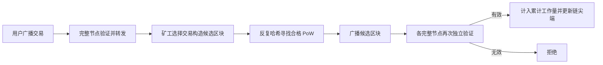

# 课次 3：BTC 的 PoW、供给与风险

资料核对日期：2026-08-29

建议用时：75 分钟

> 本课讨论协议机制与风险，不预测价格。减半、稀缺或算力变化都不能单独推出“价格必涨”。本课不购买 BTC、不连接钱包，也不进行真实转账。

## 本课要解决的问题

网络怎样决定有效历史，BTC 又怎样进入流通？

学完后，你应该能做到：

1. 解释工作量证明（Proof of Work, PoW）、目标值、难度和累计工作量；
2. 说明矿工提出区块、完整节点验证区块的角色边界；
3. 区分区块补贴、交易费和区块奖励；
4. 解释减半如何改变发行节奏，而不把它写成价格定律；
5. 区分总供应、可分割性、流通量和丢失币；
6. 准确说明多数算力攻击能做什么、不能做什么；
7. 用“机制事实 / 观察 / 市场叙事”三类标签分析 BTC。

## 75 分钟安排

| 时间 | 内容 | 产出 |
| --- | --- | --- |
| 0～10 分钟 | 从候选区块到有效区块 | 一张角色边界图 |
| 10～25 分钟 | PoW、目标、难度与累计工作量 | 能解释“最重有效链” |
| 25～38 分钟 | 区块补贴、交易费与减半 | 一张发行流程图 |
| 38～50 分钟 | 供应上限、分割与丢失币 | 四个概念对照 |
| 50～62 分钟 | 51% 攻击与确认概率 | 能说出能力边界 |
| 62～70 分钟 | 风险地图 | 五类风险清单 |
| 70～75 分钟 | 七维卡与小测 | 课后输出初稿 |

## 一、PoW 解决的不是“算一道有用数学题”

矿工把候选交易组成区块，并不断改变区块头中的 nonce 等数据，对区块头做哈希。只有当结果小于网络当前目标值（target）时，这个区块才满足 PoW 条件。

```text
区块头哈希 < 目标值  →  满足工作量证明门槛
目标值越小          →  找到合格哈希越难
难度越高            →  平均需要尝试的哈希次数越多
```

哈希结果近似不可预测，矿工没有捷径，只能大量试算。PoW 的用途是给“改写历史”附加现实世界成本，而不是让这些计算本身产生科研价值。

### 难度为什么要调整

如果全网算力增加而难度不变，区块会越来越快；算力减少则会越来越慢。Bitcoin 每 2,016 个区块按照协议规则调整难度，使长期平均出块间隔趋近约 10 分钟。

这不代表每个区块都恰好相隔 10 分钟。找到合格哈希是随机过程，连续快速或长时间没有新区块都可能发生。

## 二、不是“最长的任何链”，而是累计工作量最多的有效链

节点收到新区块时，先独立检查：

- 区块结构和 PoW 是否符合规则；
- 每笔交易的输入、脚本、签名和金额关系是否有效；
- 是否发生重复花费；
- coinbase 领取的补贴和手续费是否超出允许范围；
- 区块是否正确连接到已知历史。

只有通过验证的区块才进入候选有效链。节点在有效分支之间按累计工作量选择链尖端。口语中的“最长链”容易误导：协议比较的是累计工作量，而不是只数区块个数。



因此，高算力矿工可以提出区块，却不能命令诚实完整节点接受违反共识规则的区块。

## 三、BTC 怎样进入流通

每个区块第一笔交易是特殊的 coinbase 交易。矿工可在共识上限内领取：

```text
区块奖励 = 区块补贴 + 本区块全部交易费
```

- **区块补贴（block subsidy）**：协议允许新发行的 BTC；
- **交易费（transaction fees）**：普通交易输入减输出的差额，是已经存在的 BTC；
- **区块奖励（block reward）**：前两者合计，不应与“补贴”混用。

若 coinbase 领取超过允许额度，完整节点会拒绝整个区块。矿工也可以少领，但不能多领。

### 减半改变什么

协议每 210,000 个区块把区块补贴减半。其直接结果是单位区块允许的新发行量下降。它不直接规定：

- 市场需求；
- 交易所流动性；
- 矿工必须持有还是出售；
- 法规、宏观环境或投资者行为；
- BTC 的美元价格。

所以“补贴按规则减半”是机制事实；“供给冲击必然推高价格”是市场叙事，需要额外假设和证据。

## 四、上限、分割、流通与丢失不是一回事

Bitcoin 的补贴序列使可发行总量渐近于 2,100 万 BTC。这是共识规则下的名义上限，不是对市场价值的保证。

| 概念 | 含义 | 不应误解为 |
| --- | --- | --- |
| 总供应 | 按协议已发行、尚未被明确销毁的名义数量 | 所有币都能实际交易 |
| 发行上限 | 补贴规则的长期上限 | 每个节点保存 2,100 万枚实体币 |
| 可分割性 | 1 BTC 可按更小单位计量 | 增加了总供应 |
| 流通量 | 市场统计口径下可能流通的数量 | 能准确识别每枚丢失币 |
| 丢失币 | 密钥丢失后可能永久不可花费的输出 | 被协议从历史供应中自动扣除 |

丢失密钥通常不会在链上写入“这枚币已丢失”。外部只能依据长期不动等迹象推测，因此“有效可流通供给”无法被精确直接测量。

## 五、51% 攻击的能力边界

“51%”是对多数算力攻击的常用简称，不是按下某个开关后获得管理员权限。

攻击者可能做到：

- 更有能力重组近期区块历史；
- 先付款后重组，尝试重复花费自己控制的输入；
- 延迟或审查部分交易、造成确认不稳定；
- 通过私下挖链与公开链竞争。

仅靠多数算力不能做到：

- 伪造他人的有效签名；
- 花费不满足脚本条件的他人 UTXO；
- 让诚实完整节点接受超发、无效脚本或其他违反共识的区块；
- 凭空得知或恢复私钥；
- 永久保证所有节点和用户服从攻击链。

攻击的成功概率与攻击者算力比例、目标交易已有确认、攻击持续时间和对手响应有关。确认越多，重写所需累计工作通常越大，但不是数学意义上的绝对不可逆。

## 六、BTC 风险地图

### 1. 自托管与操作风险

密钥、助记词或备份丢失可能导致永久无法花费；泄露则可能被他人转走。地址填错和诈骗授权不由 PoW 自动补救。

### 2. 托管与交易对手风险

交易所界面余额可能只是平台内部负债。平台破产、冻结、被盗或暂停提现，与 Bitcoin 链本身是否出块是不同风险。

### 3. 协议与软件风险

共识实现曾出现安全漏洞。节点软件的多样性、升级协调和漏洞响应都属于现实系统的一部分，不能把“开源”理解为“无漏洞”。

### 4. 算力、矿池与费用市场风险

算力或区块模板决策过度集中会提高审查、重组和协调风险。补贴长期下降后，矿工收入将更加依赖交易费；未来费用安全预算是否足够，是需要持续观察的问题，不是已经证明的结论。

### 5. 治理、监管和市场风险

规则分歧可能形成软分叉、硬分叉或链分裂；监管会影响托管、交易入口和矿业活动；BTC 的市场价格和流动性可能剧烈变化。协议稀缺不等于法币计价稳定。

## 七、机制事实、观察与叙事

写作时给每句话加标签：

- **机制事实**：能由规范、代码或节点验证直接核对；
- **观察**：某个时间点的链上或市场数据，必须写日期与来源；
- **市场叙事**：对未来需求、价格或社会角色的解释，依赖假设。

示例：

| 陈述 | 分类 | 原因 |
| --- | --- | --- |
| 补贴每 210,000 个区块减半 | 机制事实 | 共识规则 |
| 某日全网算力估计值为 X | 观察 | 会变化且依赖估算方法 |
| 减半后价格一定上涨 | 市场叙事，而且表述过强 | 协议没有规定市场需求 |
| 节点拒绝超额 coinbase | 机制事实 | 可由验证规则核对 |
| BTC 是数字黄金 | 常见叙事 | 是类比，不是协议字段 |

## 八、课后输出：BTC 七维分析卡

复制到 [`../../learning-log.md`](../../learning-log.md)，先独立填写：

```markdown
### YYYY-MM-DD｜课次 3：BTC 七维分析卡

- 目标与用途：
- 网络与资产：
- 安全与共识：
- 交易模型：
- 供给与价值流：
- 信任假设：
- 典型失败方式：

#### 三个机制事实
1.
2.
3.

#### 三个市场叙事
1.
2.
3.

#### 我仍需核对的问题
-
```

## 九、检查问题

1. 为什么一个拥有极高算力的矿工仍不能让诚实完整节点接受超发区块？
2. 区块补贴、交易费、区块奖励有什么区别？
3. “最长链”这一说法为什么不够准确？
4. 丢失币为什么不会自动从链上总供应统计中消失？
5. 多数算力攻击者能否花费别人的 BTC？
6. 为什么六次确认也不是协议提供的绝对最终性按钮？
7. “减半发生”与“减半后价格上涨”分别属于哪类陈述？

<details>
<summary>完成后展开答案要点</summary>

1. 节点按本地共识规则验证；算力决定有效分支竞争力，不改变验证规则。
2. 补贴是新发行，交易费来自普通交易差额，奖励是两者合计。
3. 节点只在有效分支中比较累计工作量，不是简单比较区块数量。
4. 链上通常不知道私钥是否永久丢失，原输出仍留在历史与 UTXO 状态中。
5. 不能仅凭算力伪造签名；但可以重组近期历史、重复花费自己控制的输入或审查交易。
6. PoW 最终性是概率性的；确认增加会提高重写成本，但没有统一绝对门槛。
7. 前者是机制事实，后者是依赖市场假设的叙事或待检验预测。

</details>

## 十、完成标准

- [ ] 能画出“矿工提出、节点验证”的边界；
- [ ] 能解释目标、难度、累计工作量；
- [ ] 能区分补贴、费用和奖励；
- [ ] 能列出 51% 攻击至少三项能力和三项限制；
- [ ] 完成 BTC 七维卡；
- [ ] 三个机制事实都可追溯到一手资料；
- [ ] 三个市场叙事没有被写成协议保证。

只有完成以上输出和检查题，才能在学习日志中把课次 3 标为完成。

## 十一、核心资料

- [Bitcoin 白皮书：第 4、5、6、11 节](https://bitcoin.org/bitcoin.pdf)
- [Bitcoin Developer Guide：Block Chain](https://developer.bitcoin.org/devguide/block_chain.html)
- [Bitcoin.org：Controlled supply / Halving](https://bitcoin.org/en/halving)
- [Bitcoin Core：完整验证](https://bitcoin.org/en/bitcoin-core/features/validation)
- [Bitcoin Core：安全公告归档](https://bitcoincore.org/en/security-advisories/)

其中减半页面展示的当前补贴和预计日期属于动态信息，使用时必须重新核对；本课只把固定的共识结构写入结论。
