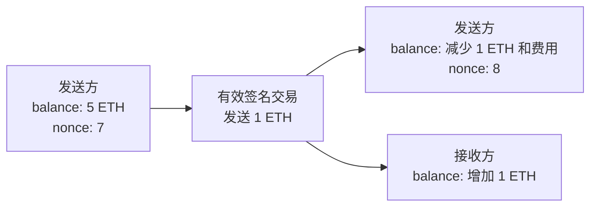

# 课次 4：Ethereum、ETH 与账户模型

资料核对日期：2026-08-29

建议用时：60 分钟

> 本课只读学习公开数据。不要创建账户、连接钱包或签名。示例地址均为结构示意，不对应学习者账户。

## 本课要解决的问题

为什么 Ethereum 被描述为可编程的状态机，而不只是转账网络？

学完后，你应该能做到：

1. 区分 Ethereum 网络、ether/ETH 原生资产和链上 token；
2. 区分外部拥有账户（EOA）与合约账户；
3. 解释账户的余额、nonce、代码和存储；
4. 对比 Ethereum 账户模型与 Bitcoin UTXO 模型；
5. 说明 ETH 在费用、网络安全和应用中的用途；
6. 理解钱包、账户、地址和资产不是同一个概念。

## 60 分钟安排

| 时间 | 内容 | 产出 |
| --- | --- | --- |
| 0～10 分钟 | 网络、原生资产、token | 三层概念图 |
| 10～24 分钟 | EOA 与合约账户 | 账户类型对照表 |
| 24～37 分钟 | 状态、nonce 与交易 | 一次状态变化示意 |
| 37～48 分钟 | 账户模型与 UTXO | 四格对照表 |
| 48～56 分钟 | ETH 的三类用途与边界 | 150 字解释 |
| 56～60 分钟 | 检查题 | 纠正课前答案 |

## 一、先把三个层次拆开

| 层次 | 是什么 | 例子 |
| --- | --- | --- |
| Ethereum | 节点执行和验证共同规则的网络与协议 | 账户状态、EVM、PoS 共识 |
| ether / ETH | Ethereum 的原生资产 | 支付网络费用、参与质押 |
| token | 由合约或其他协议逻辑定义的资产记录 | ERC-20 token、NFT |

ETH 不依赖某个 ERC-20 合约才存在，它是协议原生余额。ERC-20 token 的余额通常记录在特定 token 合约的状态里。因此：

```text
Ethereum ≠ ETH ≠ Ethereum 上的全部 token
```

把 ETH 叫作“以太坊上的一种 ERC-20”也不准确。某些应用会把 ETH 包装成遵循 ERC-20 接口的 WETH，但 WETH 是合约 token，不等于协议原生 ETH。

## 二、Ethereum 是状态转换系统

可以把 Ethereum 简化成：全网对当前状态 `S` 达成一致，执行有效交易 `T` 后得到新状态 `S'`。

```text
状态转换函数：Y(S, T) = S'
```

状态不仅包含谁有多少 ETH，还包括：

- 账户的 nonce；
- 合约代码；
- 合约存储中的变量；
- token 余额映射、授权额度等应用状态。

所以一笔交易可以不仅“转钱”，还可以调用程序，让多个账户和合约状态按确定性规则一起改变。

## 三、两类账户

### 1. 外部拥有账户（EOA）

EOA 传统上由私钥控制。持有对应私钥的人可以签署交易。创建一对密钥本身不需要链上交易，但第一次在链上使用会产生相应状态和费用。

### 2. 合约账户

合约账户由部署在特定地址的代码控制，没有像 EOA 那样的私钥。它收到调用后按代码执行，可以持有 ETH、记录 token、调用其他合约或创建合约。

| 项目 | EOA | 合约账户 |
| --- | --- | --- |
| 控制方式 | 传统上由私钥签名 | 由合约代码逻辑控制 |
| 是否有代码 | 通常无合约代码 | 有 EVM 字节码 |
| 发起状态变化 | 传统协议交易入口 | 通常响应调用再执行消息调用 |
| 创建成本 | 生成密钥不产生链上费 | 部署代码需要链上资源 |
| 可持有 ETH/token | 可以 | 可以 |

### 账户抽象的补充

上表是理解基础协议的起点，但现代账户抽象会让智能合约钱包表现得像用户账户，也可能由代付者（paymaster）承担 Gas。因此不要把“所有写操作都必须由用户本人持 ETH 的 EOA 发起”当成永远成立的绝对规则。底层仍必须有符合当前协议规则的交易被网络纳入区块。

## 四、账户里有哪些状态

Ethereum 官方文档用四个字段解释账户：

- `nonce`：EOA 已发送交易的计数，或合约创建相关计数；防止同一签名交易被重复执行；
- `balance`：账户拥有的 wei 数量，`1 ETH = 10^18 wei`；
- `codeHash`：合约代码的哈希；EOA 对应空代码；
- `storageRoot`：承诺合约持久存储内容的根哈希。

区块浏览器可能把许多衍生信息聚合在地址页面，但并非每项都是账户对象的原生字段。

### nonce 的直觉

假设某 EOA 当前 nonce 为 7，那么下一笔传统交易通常使用 nonce 7。该交易执行后，账户 nonce 变为 8。同一个 nonce 不能被同一账户的两笔交易都在同一条规范历史中执行。

这带来两个常见现象：

- nonce 较小的待处理交易可能挡住后续交易；
- 使用相同 nonce 和更高费用的新交易可能替换尚未确认的旧交易。

nonce 不是“交易确认数”，也不是账户密码。

## 五、一笔交易改变什么

以简单 ETH 转账为例，忽略具体费用数值：



若接收方是合约，交易还可携带输入数据，触发函数执行并修改多个合约的存储。执行结果必须由所有验证节点按相同规则重算。

## 六、账户模型与 UTXO 模型

| 维度 | Bitcoin UTXO | Ethereum 账户模型 |
| --- | --- | --- |
| 基本可花费状态 | 离散的未花费输出 | 账户余额和其他状态 |
| 普通转账 | 消费完整旧输出，创建新输出 | 直接更新发送方与接收方状态 |
| 防止重复执行 | UTXO 一旦花费不能再花 | nonce 保证交易顺序与唯一执行 |
| 找零 | 常见，需要新找零输出 | 简单转账无需找零输出 |
| 程序状态 | 由脚本约束输出花费 | 通用 EVM 合约状态 |
| 钱包余额 | 识别并汇总可花费 UTXO | 读取原生余额及各合约 token 状态 |

两种模型都不是简单的银行数据库复制品。它们都依赖密码学授权、全网验证和共识排序，只是状态表达方式不同。

## 七、ETH 为什么是原生资产

### 1. 支付执行和区块空间费用

Ethereum 用 Gas 计量执行与存储资源，网络费用以 ETH 结算。应用 token 的价值不能自动替代底层协议对 ETH 的费用需求；某些代付系统只是由第三方替用户承担或转换费用。

### 2. 参与 PoS 网络安全

验证者质押 ETH，正确履职可获得协议奖励，离线或违反特定规则会受到惩罚。ETH 因而是网络安全经济机制的一部分。

### 3. 作为应用中的原生资产

合约可接收、持有和转移 ETH，应用也可把它作为抵押品或计价资产。但具体应用会增加智能合约、预言机和治理风险。

这些用途解释“为什么协议需要 ETH”，不等于 ETH 的价格、收益或购买适合性得到保证。

## 八、钱包、账户、地址与资产

- **地址**：用于标识账户的 20 字节值，常显示为 `0x` 开头的十六进制字符串；
- **账户**：协议状态中的实体；
- **钱包**：帮助管理密钥、构造签名、读取账户和 token 状态的界面或软件；
- **资产**：可能是原生 ETH，也可能是某合约记录的 token。

一个钱包可管理多个账户；一个地址可同时有 ETH 余额和多个 token 合约中的余额；相同 token 名称也可能由不同合约伪造。

## 九、课后输出：BTC 与 ETH 四格对照

复制到 [`../../learning-log.md`](../../learning-log.md)：

```markdown
### YYYY-MM-DD｜课次 4：BTC 与 ETH 四格对照

| 维度 | BTC | ETH |
| --- | --- | --- |
| 网络 | | |
| 原生资产 | | |
| 交易模型 | | |
| 主要用途 | | |

我的 150 字总结：
```

总结中必须出现“ETH 不是所有 Ethereum token 的统称”和“用途不等于价格保证”。

## 十、检查问题

1. 某地址页面同时显示 2 ETH 和 500 个 ABC token，这两个余额分别记录在哪里？
2. EOA 与合约账户的控制方式有什么差别？
3. nonce 解决什么问题？
4. Ethereum 简单转账为什么通常没有 Bitcoin 式找零？
5. 为什么持有某 ERC-20 token 后，执行该 token 的转账仍可能需要 ETH？
6. 智能合约钱包是否推翻了“合约由代码控制”这一点？

<details>
<summary>完成后展开答案要点</summary>

1. ETH 是协议原生账户余额；ABC 通常记录在 ABC 合约的状态映射中。
2. EOA 传统上由私钥签名控制；合约账户按部署代码响应调用。
3. 它提供账户交易序列和防重放机制。
4. 账户模型直接更新余额，不需要完整消费离散输出再创建找零。
5. token 是合约状态，底层执行资源通常仍以原生 ETH 计费；代付是额外机制。
6. 没有。账户抽象扩展了交易入口与授权体验，合约账户仍由代码规则控制。

</details>

## 十一、常见误区

- **ETH 是 Ethereum 上所有币的总称。** ETH 是原生资产，token 由各自合约或协议定义。
- **地址就是钱包。** 地址是标识；钱包是管理和交互工具。
- **合约账户一定安全。** 代码可能有漏洞、管理员权限或错误经济假设。
- **账户模型就是银行账户。** Ethereum 状态由分布式验证和共识维护，权限与结算方式不同。
- **任何 token 都能直接付 Gas。** 协议费用以 ETH 结算；代付或抽象服务增加了中间机制。
- **ETH 有用途，所以价格必涨。** 用途事实不能直接推出市场价格。

## 十二、完成标准

- [ ] 能不看资料画出 Ethereum、ETH、token 三层关系；
- [ ] 能区分 EOA 与合约账户；
- [ ] 能解释 nonce 和余额的状态变化；
- [ ] 完成 BTC/ETH 四格对照；
- [ ] 能指出账户抽象对传统描述的修正；
- [ ] 检查题至少答对 5 题。

## 十三、核心资料

- [Ethereum 官方文档：Accounts](https://ethereum.org/developers/docs/accounts/)
- [Ethereum 官方文档：Transactions](https://ethereum.org/developers/docs/transactions/)
- [Ethereum 官方文档：EVM](https://ethereum.org/developers/docs/evm/)
- [Ethereum 官方文档：Ether 技术简介](https://ethereum.org/developers/docs/intro-to-ether)
- [Ethereum 官方文档：Account abstraction](https://ethereum.org/roadmap/account-abstraction/)
