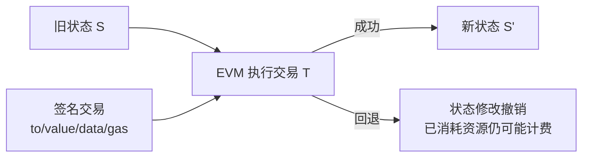
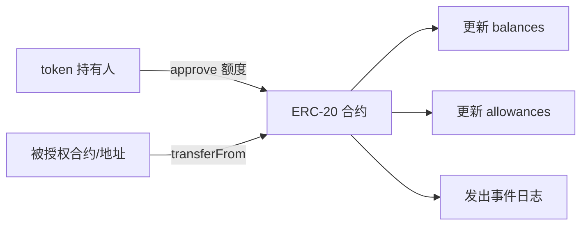

# 课次 5：EVM、智能合约与 token

资料核对日期：2026-08-29

建议用时：75 分钟

> 本课只使用区块浏览器的只读页面。不要点击 Connect Wallet、Write Contract、Approve 或签名按钮；不要复制自己的地址。合约“已验证源码”只表示公开源码与部署字节码的对应关系得到工具核对，不等于安全审计。

## 本课要解决的问题

链上程序能做什么，不能保证什么？

学完后，你应该能做到：

1. 用状态转换解释 EVM 的作用；
2. 区分合约代码、存储、函数、事件与交易输入；
3. 区分只读调用与改变状态的交易；
4. 解释 ERC-20 为什么是接口标准而不是质量认证；
5. 说明 ETH 余额与 token 余额记录位置不同；
6. 识别授权、管理员、升级、预言机和组合性风险。

## 75 分钟安排

| 时间 | 内容 | 产出 |
| --- | --- | --- |
| 0～15 分钟 | EVM、代码与状态 | 状态转换图 |
| 15～28 分钟 | 部署、调用、ABI 与事件 | 五个术语解释 |
| 28～43 分钟 | ERC-20 接口 | 调用关系图 |
| 43～58 分钟 | 合约能力边界与风险 | 风险检查表 |
| 58～68 分钟 | 浏览器只读练习 | 一份公开合约观察 |
| 68～75 分钟 | 200 字输出与检查题 | 初稿 |

## 一、EVM 是确定性执行环境

Ethereum 虚拟机（Ethereum Virtual Machine, EVM）在每个执行节点上按照相同规则运行合约字节码。给定相同旧状态和有效交易，诚实实现应得到相同新状态。



EVM 不判断一个项目是否值得信任，也不理解现实世界合同的公平性。它只按协议和字节码执行。

## 二、合约的五个基本部件

### 1. 代码

开发者把高级语言编译成 EVM 字节码并部署到链上。链上执行的是字节码，不是网页界面展示的营销说明。

### 2. 存储

合约可保存长期状态，例如 token 余额、授权额度、管理员地址或应用参数。存储写入通常比简单计算消耗更多 Gas。

### 3. 函数与调用数据

交易的 `data` 可以编码要调用的函数及参数。应用通过合约 ABI（Application Binary Interface）知道如何编码调用、解码返回值和事件。

### 4. 事件日志

合约执行可以发出 event，方便浏览器和应用索引。例如 ERC-20 转账通常发出 `Transfer` 事件。事件适合观察，但它不是可以被后续合约直接读取的持久存储，也不能单独代替全部状态验证。

### 5. 余额

合约账户可以持有原生 ETH；合约还可以在自己的存储中记录各地址的 token 余额。这两类余额不要混为一谈。

## 三、部署、读取与写入

### 部署

部署合约是一笔创建交易。它携带初始化代码，执行后在新地址留下运行时代码和初始状态，需要占用计算与存储资源。

### 只读调用

读取余额、查看 `owner()` 或查询参数，可由本地节点模拟执行，不写入区块。常见的 `eth_call` 不产生链上状态变化，也不要求为链上执行支付 Gas。

“不付链上 Gas”不等于完全没有成本：RPC 服务商和节点仍消耗资源，第三方接口也可能收费或记录请求。

### 写入

转移 token、修改参数或执行兑换会改变状态，需要一笔被纳入区块的交易，并按实际执行消耗 Gas。传统流程由 EOA 签名；账户抽象也可由智能账户和代付机制组织。

### 失败与回退

若执行遇到 `revert`、超出 Gas 或其他异常，通常会回退该调用产生的状态修改，但验证者已经执行并消耗了区块资源，所以发送者仍可能支付已使用 Gas。失败交易不等于“什么都没发生”：nonce 往往已消耗，费用已经支付，日志和状态是否保留要按回退边界判断。

## 四、ERC-20 到底标准化什么

ERC-20 定义一组可复用接口和事件，例如：

- `totalSupply()`：读取 token 供应；
- `balanceOf(owner)`：读取某地址余额；
- `transfer(to, value)`：转移调用者的 token；
- `approve(spender, value)`：设置可代花额度；
- `allowance(owner, spender)`：读取授权额度；
- `transferFrom(from, to, value)`：在授权范围内代为转移；
- `Transfer` 与 `Approval` 事件。



接口统一让钱包和应用更容易集成，但标准本身不保证：

- 供应上限固定；
- 发行方不能增发或冻结；
- 管理员权限安全；
- 合约经过审计；
- token 有真实资产支持；
- 市场有流动性或合理价格；
- 名称和图标不会仿冒。

## 五、授权为什么需要单独理解

`approve` 不等于立刻转账，而是允许指定 `spender` 在额度内调用 `transferFrom`。风险来自授权对象和额度：

- 恶意或被攻破的 spender 可能使用剩余额度；
- “无限授权”把未来余额也暴露在权限范围内；
- 前端显示的名称不能证明合约地址正确；
- 撤销授权本身通常也是状态写入交易。

本阶段只学习概念，不连接钱包查看或撤销真实授权。

## 六、“代码运行”不等于“系统安全”

把风险分层会更清晰：

| 风险层 | 要问的问题 |
| --- | --- |
| 代码 | 是否有重入、权限、精度、边界条件等漏洞？ |
| 升级 | 是否使用代理？谁能升级实现？是否有时间锁？ |
| 管理 | 谁能暂停、冻结、增发、修改参数？密钥是否多签？ |
| 预言机 | 链外价格或事件从哪里来？能否操纵或停止？ |
| 经济 | 抵押、清算、激励在压力下是否仍成立？ |
| 组合性 | 依赖的其他合约、桥或 token 失败会怎样？ |
| 界面 | 网站、DNS、前端和 RPC 是否可能被替换？ |

“不可篡改”也要具体分析：直接部署的字节码通常不变，但代理模式可以把用户调用转发到可升级实现；管理员还可能通过状态参数改变系统行为。

## 七、区块浏览器只读练习

选择一个发行方官网能直接链接到官方合约地址的知名 ERC-20。不要只按浏览器搜索结果选择同名 token。

记录：

```markdown
### YYYY-MM-DD｜课次 5：ERC-20 合约只读观察

- 核对时间及时区：
- 发行方或项目官方合约地址来源：
- 网络：
- 合约地址（公开示例，不是本人地址）：
- token 名称与 symbol：
- 浏览器是否显示源码已验证：是 / 否 / 不确定
- 能识别的 Read 函数：
- 能识别的 Write 函数：
- 是否看到代理或管理员标签：
- Transfer 事件说明了什么：
- 浏览器标签中哪些只是第三方信息：
- 我没有执行的操作：Connect / Write / Approve / Sign
```

如果页面弹出连接钱包提示，关闭即可。只读练习不需要钱包。

## 八、200 字输出

题目：**为什么“ETH 不是所有以太坊 token 的统称”？**

至少包含：

1. ETH 是协议原生资产；
2. token 余额由特定合约或协议状态定义；
3. ERC-20 只规定接口；
4. token 交易需要底层执行资源；
5. 同名 token 必须核对网络和合约地址。

## 九、检查问题

1. 区块浏览器显示“Contract Source Code Verified”是否等于安全审计通过？
2. `eth_call` 与写入交易的核心差别是什么？
3. ERC-20 的 `approve` 和 `transfer` 分别做什么？
4. 一个 ERC-20 token 能否保留相同接口同时允许管理员增发？
5. 合约执行失败后为什么仍可能付费？
6. 代理合约为什么使“代码不可更改”这句话需要限定？

<details>
<summary>完成后展开答案要点</summary>

1. 不是。它主要核对公开源码与部署字节码，不能证明逻辑、权限和经济机制安全。
2. `eth_call` 本地模拟读取且不改链上状态；写入交易要被共识执行并付费。
3. `approve` 设置 spender 的代花额度；`transfer` 直接移动调用者的 token 余额。
4. 可以。标准化接口不限制所有供应与管理员逻辑。
5. 网络已执行并消耗资源；状态回退不等于资源未使用。
6. 用户交互地址可能通过代理委托给可升级实现，管理员可改变实际执行逻辑。

</details>

## 十、常见误区

- **智能合约是真实世界合同的自动法律执行。** 它首先是链上程序，法律效力需另行判断。
- **ERC-20 是 Ethereum 官方背书。** 它是接口标准，不是认证。
- **事件就是最终状态。** 事件是日志，完整判断还需查看执行状态和合约存储。
- **读取合约完全没有资源成本。** 不产生链上 Gas，但节点和服务仍承担计算。
- **失败交易会退回全部费用。** 已使用 Gas 通常仍支付。
- **源码公开就没有管理员后门。** 权限必须逐项阅读，代理实现也要核对。

## 十一、完成标准

- [ ] 能画出交易数据进入 EVM 后的状态变化；
- [ ] 能区分代码、存储、函数、事件与 ABI；
- [ ] 能解释 ERC-20 的标准边界；
- [ ] 完成一次不连接钱包的合约观察；
- [ ] 200 字输出包含五个指定要点；
- [ ] 检查题至少答对 5 题。

## 十二、核心资料

- [Ethereum 官方文档：EVM](https://ethereum.org/developers/docs/evm/)
- [Ethereum 官方文档：智能合约简介](https://ethereum.org/developers/docs/smart-contracts/)
- [Ethereum 官方文档：与智能合约交互](https://ethereum.org/developers/docs/smart-contracts/interacting/)
- [ERC-20 标准（EIP-20）](https://eips.ethereum.org/EIPS/eip-20)
- [Ethereum 官方文档：交易](https://ethereum.org/developers/docs/transactions/)
