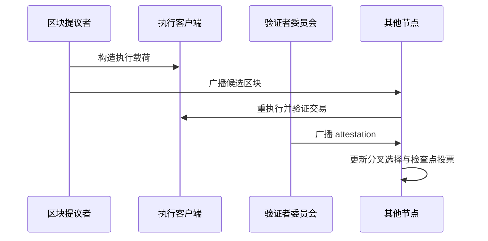

# 课次 7：PoS、ETH 供给与风险

资料核对日期：2026-08-29

建议用时：75 分钟

> 本课解释协议安全与供应机制，不讨论质押产品收益率，也不要求质押 ETH。第三方质押平台、流动性质押 token 和再质押会增加额外风险，不应与原生协议验证混为一谈。

## 本课要解决的问题

Ethereum 如何用质押和惩罚保护共识？

学完后，你应该能做到：

1. 区分执行客户端、共识客户端和验证者客户端；
2. 解释区块提议、证明（attestation）、分叉选择和最终性；
3. 区分普通离线惩罚与罚没（slashing）；
4. 说明验证者奖励为何不是无风险利息；
5. 用“发行减去销毁”解释 ETH 净供应变化；
6. 比较 PoW 与 PoS 的攻击资源和惩罚；
7. 建立 ETH 风险地图。

## 75 分钟安排

| 时间 | 内容 | 产出 |
| --- | --- | --- |
| 0～12 分钟 | 节点与客户端 | 软件角色图 |
| 12～30 分钟 | slot、epoch、提议与证明 | 共识时序图 |
| 30～43 分钟 | 最终性、惩罚与罚没 | 能力边界表 |
| 43～55 分钟 | 发行、费用销毁与净供应 | 供应公式 |
| 55～66 分钟 | PoW/PoS 与风险地图 | 对照表 |
| 66～75 分钟 | ETH 七维卡与检查题 | 课后输出 |

## 一、Ethereum 节点为什么需要两套核心视角

PoS Ethereum 节点通常组合：

- **执行客户端**：处理交易、EVM、账户与合约状态；
- **共识客户端**：处理验证者投票、分叉选择与最终性；
- **验证者客户端**：在有质押资格时，管理提议和证明职责。

普通完整节点可以验证链而不运行验证者，也不需要质押 32 ETH。运行验证者才需要按协议存入有效余额并承担在线与签名职责。

## 二、slot、epoch、提议与证明

资料核对日的协议参数中：一个 slot 为 12 秒，一个 epoch 有 32 个 slot。参数可能随未来升级改变，使用时应重新核对。

每个 slot：

1. 协议选出一个验证者作为区块提议者；
2. 提议者构造并广播区块；
3. 被分配的验证者委员会验证区块和链视图；
4. 验证者签署并广播证明（attestation）；
5. 共识客户端用投票和分叉选择规则确定当前链头。



attestation 不只是“看到了区块”。它包含验证者对链头及最终性检查点的投票信息。

## 三、最终性不是“看到一个区块就结束”

Ethereum 使用检查点和 Casper FFG 形成经济最终性。简化地：

- 每个 epoch 的首个区块是检查点；
- 代表至少三分之二质押权重的投票可使检查点 justified；
- 连续满足规则后，较早检查点可 finalized；
- 回退 finalized 区块需要造成大规模可罚没行为和共识失败。

区块刚出现时可能先是 proposed/confirmed，随后才 justified/finalized。应用界面的“确认”与协议最终性标签不一定同义。

若约三分之一质押权重拒绝配合，可以妨碍最终性；协议通过 inactivity leak 等机制逐步削弱不参与一方权重，使诚实多数有机会恢复最终性。这仍可能伴随长时间中断和社会协调。

## 四、奖励、惩罚与罚没

验证者正确提议、及时证明和参与同步委员会等职责可获得 ETH 奖励。奖励来自协议发行以及区块相关收入的一部分，但并非固定利率。

### 普通惩罚

离线、迟到或错误投票会减少奖励或产生余额惩罚。它针对未履职，不一定构成 slashing。

### 罚没（slashing）

对危害共识的可证明违规，例如同一 slot 双重提议、提交相互冲突的特定证明，协议可削减验证者余额并强制退出。多人相关违规时惩罚可能更重，以提高协同攻击成本。

### 为什么不是银行利息

- 收益率随总质押量、履职和网络活动变化；
- 验证者有运维、离线、密钥与罚没风险；
- 退出和提款可能受队列与协议条件影响；
- ETH 本身对法币价格波动；
- 使用服务商会增加托管、智能合约、流动性 token 与治理风险。

## 五、ETH 供应：发行与销毁同时存在

净供应变化可以写成：

```text
某期间 ETH 净变化 = 共识层新发行 − 基础费用销毁 − 其他协议销毁/惩罚影响
```

The Merge 后，PoW 执行层矿工发行停止，验证者仍有共识层发行。EIP-1559 的基础费用在交易执行时销毁；优先费不属于基础费用销毁。

因此：

- 网络活动低、销毁少时，净供应可能增加；
- 网络活动高、销毁超过发行时，净供应可能减少；
- 总质押量和协议参数会影响发行；
- 未来升级可能改变参数。

“ETH 固定通胀”和“ETH 永远通缩”都不准确。正确说法是：净供应由动态发行与动态销毁共同决定，必须指定观察区间和数据来源。

## 六、PoW 与 PoS 的安全经济比较

| 维度 | Bitcoin PoW | Ethereum PoS |
| --- | --- | --- |
| 参与出块资源 | 算力、设备、电力与运营 | 质押 ETH、节点与在线履职 |
| 分支选择核心 | 累计工作量 | 验证者投票、分叉选择与最终性 |
| 直接协议惩罚 | 无“烧掉矿机”；攻击消耗机会成本和能源 | 可削减质押、强制退出 |
| 最终性 | 概率性，确认增加提高重写成本 | 检查点经济最终性 |
| 集中风险 | 矿池、硬件、能源与地理集中 | 质押服务商、客户端、云与治理集中 |

不能仅比较“需要多少钱”。PoW 设备可能被转用或转售，PoS 质押可能被协议识别并罚没；攻击可见性、协调、持续时间和社会响应也不同。

## 七、ETH 风险地图

### 共识与验证者集中

大型质押服务商或流动性质押协议占比过高，可能增加审查、相关故障和治理影响。质押份额并不等于可以让节点接受任意无效 EVM 状态，但会影响活性和共识安全。

### 客户端实现风险

若大量节点使用同一客户端，单一软件漏洞可能造成相关故障或罚没。执行层和共识层都要关注实现多样性。

### 智能合约与应用风险

ETH 被存入合约后会继承合约漏洞、管理员、预言机、清算和组合性风险。Ethereum 网络正常不代表应用资金安全。

### MEV 与排序风险

区块构建者可从交易排序、插入或重排中提取价值。MEV 会影响公平性、用户成交和中心化激励，但不应被简化成所有 MEV 都是同一类攻击。

### L2、桥与治理风险

L2 和跨链桥增加排序器、证明、数据可用性、升级密钥和提款路径。协议升级也需要开发者、节点运营者和社区协调，可能产生分歧。

### 市场、托管与监管风险

ETH 价格可能剧烈波动；托管平台可能失败；不同司法辖区对质押、token 和服务商的规则会变化。

## 八、课后输出：ETH 七维分析卡

复制到 [`../../learning-log.md`](../../learning-log.md)：

```markdown
### YYYY-MM-DD｜课次 7：ETH 七维分析卡

- 目标与用途：
- 网络与资产：
- 安全与共识：
- 交易模型：
- 供给与价值流：
- 信任假设：
- 典型失败方式：

#### PoW 与 PoS 攻击资源比较
| 问题 | PoW | PoS |
| --- | --- | --- |
| 攻击者需要控制什么 | | |
| 持续攻击的成本 | | |
| 协议可直接施加的惩罚 | | |
| 攻击后可能的社会响应 | | |

#### 动态事实核对
- 核对日期：
- 当前总供应/净发行观察来源：
- 当前质押参数来源：
- 哪些数字不应长期写死：
```

## 九、检查问题

1. 普通节点是否必须质押才能验证 Ethereum？
2. 区块提议与 attestation 分别是什么？
3. 离线惩罚是否都叫 slashing？
4. finalized 区块为什么比刚提议的区块有更强保证？
5. 为什么不能只看发行量判断 ETH 是否通胀？
6. 为什么第三方“质押收益”可能比原生验证多出数层风险？
7. 质押多数能否令诚实执行节点接受一笔违反 EVM 规则的交易？

<details>
<summary>完成后展开答案要点</summary>

1. 不需要。验证链与成为验证者是不同角色。
2. 提议者构造候选区块；证明是验证者对链头和检查点的签名投票。
3. 不是。普通未履职惩罚与针对特定可证明违规的罚没要区分。
4. 它已获得规定的质押权重检查点投票，回退会触发大规模经济惩罚和共识失败。
5. 基础费用等 ETH 会被销毁，净变化是发行与销毁的差额。
6. 还可能包含托管、智能合约、流动性 token、运营商和治理风险。
7. 不能仅凭质押权重改变执行有效性规则；但可严重影响排序、活性和最终性，并造成共识危机。

</details>

## 十、完成标准

- [ ] 能画出提议、执行验证、证明和最终性的流程；
- [ ] 能区分惩罚与罚没；
- [ ] 能用公式解释净供应；
- [ ] 完成 ETH 七维卡；
- [ ] 完成 PoW/PoS 资源比较；
- [ ] 动态数字带核对日期和来源；
- [ ] 检查题至少答对 6 题。

## 十一、核心资料

- [Ethereum 官方文档：Proof of Stake](https://ethereum.org/developers/docs/consensus-mechanisms/pos/)
- [Ethereum 官方文档：Attestations](https://ethereum.org/developers/docs/consensus-mechanisms/pos/attestations/)
- [Ethereum 官方文档：Rewards and penalties](https://ethereum.org/developers/docs/consensus-mechanisms/pos/rewards-and-penalties/)
- [Ethereum 官方文档：The Merge 对 ETH 供应的影响](https://ethereum.org/roadmap/merge/issuance/)
- [EIP-1559](https://eips.ethereum.org/EIPS/eip-1559)

协议参数和供应统计会变化；本讲义只固定解释关系，具体数值在学习当日重新核对。
