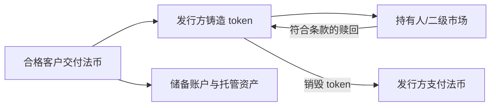
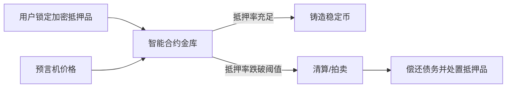
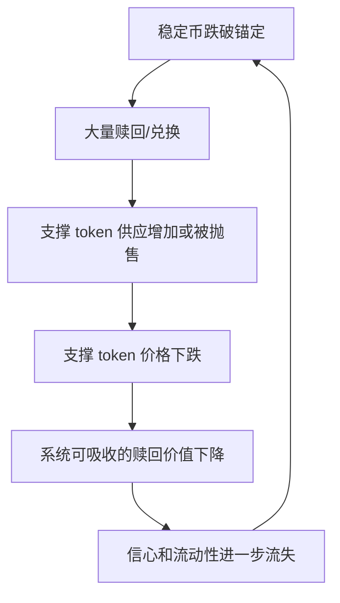

# 课次 8：稳定币分类与稳定机制

资料核对日期：2026-08-29

建议用时：75 分钟

> “稳定币”描述的是设计目标，不是无风险保证。本课不购买稳定币、不连接钱包、不参与铸造、赎回、抵押或清算，只分析公开机制。

## 本课要解决的问题

稳定币的“稳定”由什么资产、承诺和机制支撑？

学完后，你应该能做到：

1. 区分参考资产、市场价格和赎回价格；
2. 解释法币储备型稳定币的发行、储备与赎回链条；
3. 解释加密资产超额抵押、预言机和清算；
4. 解释算法型或弱抵押模型的反身性与死亡螺旋；
5. 为三类模型画出信任边界；
6. 从信用、流动性、技术、治理和监管维度识别风险。

## 75 分钟安排

| 时间 | 内容 | 产出 |
| --- | --- | --- |
| 0～12 分钟 | “稳定”的三个命题 | 概念对照 |
| 12～30 分钟 | 法币储备型 | 信任链图 |
| 30～47 分钟 | 加密资产超额抵押型 | 抵押与清算图 |
| 47～59 分钟 | 算法型/弱抵押型 | 失效循环图 |
| 59～68 分钟 | 跨模型风险 | 风险矩阵 |
| 68～75 分钟 | 输出与检查题 | 三类机制图 |

## 一、“稳定”至少包含三个不同命题

### 1. 设计目标

token 的机制试图让其价值相对某参考资产保持稳定，例如 1 美元。这是目标描述。

### 2. 二级市场价格

交易所或链上资金池的最新成交价接近 1 美元。这是特定市场、特定时点的观察，会受流动性和报价影响。

### 3. 赎回权

符合条件的持有人可按条款向某发行方或协议交回 token，取得约定参考资产。这是法律或协议权利，受到资格、费用、时间、限额和暂停条款约束。

```text
市场价约 1 美元
≠ 所有人都能直接按 1:1 赎回
≠ 储备在所有压力情景下绝对无损
```

套利者通常通过“低于锚定价买入并赎回”或“按面值铸造后高价卖出”帮助收敛价格，但只有真正拥有铸造/赎回通道、资金和合规资格的人才能完整执行。

## 二、法币储备型

### 正常机制



理想情况下，流通 token 对应足额、优质且高流动性的储备，发行方能及时按面值赎回。价格偏离时，具备通道的机构套利帮助恢复锚定。

### 必须信任的对象

- 发行主体正确记录发行量和负债；
- 银行、托管人和基金安全持有储备；
- 储备资产质量、期限和流动性足以应对赎回；
- 鉴证或审计披露范围准确；
- 法律结构使持有人有可执行请求权；
- 铸造、销毁、冻结和跨链记账正确运行；
- 监管或司法行动不会突然阻断关键通道。

### 典型失效

- 储备资产亏损、期限过长或无法及时变现；
- 托管银行关闭、冻结或进入处置程序；
- 发行方无力、无意或依法不能及时赎回；
- 披露滞后、范围有限或与公众理解不一致；
- 大量赎回形成挤兑，二级市场先失去信心；
- 某条链、合约或发行方运营系统故障。

## 三、加密资产超额抵押型

用户把价值高于所铸稳定币的加密资产锁入合约。例如目标铸造 100 单位稳定币，协议可能要求初始抵押价值明显高于 100，以吸收价格下跌。



### 为什么要超额抵押

抵押品价格波动较大。超额部分是安全缓冲，使系统在市场下跌和清算延迟时仍可能覆盖稳定币债务。

### 新增信任假设

- 智能合约没有关键漏洞；
- 预言机及时且抗操纵；
- 清算人有激励和市场流动性；
- 抵押品在压力下仍能成交；
- 治理不能恶意改变抵押率、费用或资产白名单；
- 关联稳定币、桥和托管资产不会同时失效。

“链上可见抵押”提高可观察性，但不自动消除抵押品质量、代码和治理风险。

## 四、算法型或弱抵押型

这类系统主要依靠供需激励、与另一 token 的兑换或动态扩缩供应维持锚定，缺乏足额高质量外部储备，或储备与负债之间存在较大风险错配。

简化的正向假设：

```text
稳定币低于 1 → 套利者买入并兑换/销毁 → 供应减少 → 价格回升
```

压力下可能反转：



如果支撑 token 的价值主要来自“市场相信稳定币会继续稳定”，两个资产会形成反身性。信心丧失时，名义套利机会可能因流动性、限额、链上拥堵和支撑资产暴跌而无法执行，出现死亡螺旋。

算法机制不是天然必败，但安全结论必须建立在压力测试、外部资产、限额、治理和市场深度上，而不能只看正常时期价格曲线。

## 五、三类模型统一比较

| 维度 | 法币储备型 | 加密资产超额抵押型 | 算法型/弱抵押型 |
| --- | --- | --- | --- |
| 主要支撑 | 链外储备与发行方承诺 | 链上超额抵押品 | 市场激励、另一 token 或部分储备 |
| 赎回路径 | 向发行方/合格中介赎回 | 偿还债务、清算或协议兑换 | 按机制兑换/铸销 |
| 关键价格来源 | 储备资产与二级市场 | 抵押品预言机 | 市场与机制内部价格 |
| 中心化点 | 发行方、银行、托管、合规 | 治理、预言机、前端，程度各异 | 治理、机制参数、流动性 |
| 主要压力 | 挤兑与储备流动性 | 抵押暴跌与清算拥堵 | 反身性和信心崩溃 |
| 可见性 | 储备多在链外，依赖披露 | 抵押常可链上观察 | 需同时看支撑资产与市场 |

现实产品可能是混合模型，不能只按名称分类。应逐项查抵押物、赎回权和控制权限。

## 六、稳定币没有消除哪些风险

### 信用风险

发行方、银行、借款人或支撑资产违约。

### 流动性风险

储备足额但不能及时变现，或二级市场深度不足。屏幕上的最后成交价不保证大额成交。

### 市场风险

抵押品或储备证券价格下降，稳定币相对锚定资产波动。

### 技术风险

智能合约、链、预言机、桥、钱包或前端故障。

### 治理与操作风险

管理员密钥被盗、参数错误、披露滞后、发行和销毁对账失败。

### 法律与监管风险

持有人请求权不清、地区资格限制、资产冻结、服务暂停或规则改变。

### 锚定资产自身风险

美元稳定币减少相对美元的短期波动，但仍承受美元通胀和汇率风险；对非美元使用者，“稳定”不等于购买力稳定。

## 七、输出：三类机制图

为每类模型填写：

```markdown
### 稳定币机制卡

- 类型：
- 锚定对象：
- 支撑来源：
- 谁能铸造：
- 谁能直接赎回：
- 正常套利路径：
- 必须信任的主体/代码/数据：
- 压力情景：
- 最坏失效方式：
- 哪些结论来自发行方声明：
- 哪些结论有独立证据：
```

三张卡完成后，再画“支撑来源 → 铸造/赎回 → 失效条件”总图，记录到 [`../../learning-log.md`](../../learning-log.md)。

## 八、检查问题

1. 市场价为 1.00 美元是否证明所有人都能向发行方赎回？
2. “100% backed”还需要追问哪些问题？
3. 超额抵押为什么仍可能出现坏账？
4. 预言机错误会怎样影响清算？
5. 算法稳定币的支撑 token 为什么可能产生反身性？
6. 储备型稳定币是否等同受存款保险保护的银行存款？
7. 为什么交易所报价不能替代赎回条款？

<details>
<summary>完成后展开答案要点</summary>

1. 不能。直接赎回可能受账户、KYC、地区、最低额和费用限制。
2. 资产组成、估值、期限、流动性、托管、隔离、负债口径、披露范围与赎回资格。
3. 抵押品可能快速下跌，预言机延迟，清算拥堵或买方不足。
4. 可能错误清算健康仓位，或未及时清算危险仓位。
5. 其价值与稳定币信心相互支撑，抛压会削弱赎回能力并进一步打击信心。
6. 不一定。要看发行主体、司法辖区和明确保障，不能从“稳定币”名称推断。
7. 报价是局部市场观察；赎回条款定义法律权利、资格和流程。

</details>

## 九、完成标准

- [ ] 能区分价格、锚定目标和赎回权；
- [ ] 完成三类稳定机制图；
- [ ] 每类列出至少五项信任假设；
- [ ] 能解释超额抵押与死亡螺旋；
- [ ] 能列出至少六类稳定币风险；
- [ ] 检查题至少答对 6 题。

## 十、核心资料

- [金融稳定理事会（FSB）：全球稳定币安排监管建议](https://www.fsb.org/2023/07/high-level-recommendations-for-the-regulation-supervision-and-oversight-of-global-stablecoin-arrangements-final-report/)
- [巴塞尔委员会：Cryptoasset exposures 中的赎回风险测试](https://www.bis.org/committees/bcbs/basel-framework/standard/sco/60/inforce/2026-01-01/published/2024-11-27)
- [美国 SEC 公司金融部：Statement on Stablecoins](https://www.sec.gov/newsroom/speeches-statements/statement-stablecoins-040425)

监管文件描述的是特定框架、范围或政策观点，不代表所有稳定币都满足其中条件，也不是对任何产品的投资背书。
