# 课次 10：脱锚、链与跨链风险

资料核对日期：2026-08-29

建议用时：75 分钟

> 本课是只读情景演练。遇到真实脱锚或平台暂停时，不要因本讲义自行抢兑、跨链或转账；先核对事实和自己的法律/托管关系。任何可能移动资金的行动都不属于本阶段任务。

## 本课要解决的问题

同一个稳定币名称为什么可能对应不同风险？

学完后，你应该能做到：

1. 区分价格偏离、持续脱锚和赎回受损；
2. 区分原生发行、规范桥接、第三方包装和仿冒 token；
3. 同时核对网络、合约地址、发行路径和赎回路径；
4. 解释桥合约、消息验证和流动性桥的风险；
5. 区分平台充提暂停、链停止出块与发行方暂停；
6. 用统一流程处理 0.97 报价、暂停充值和同名合约情景。

## 一、先拆开三种异常

| 状态 | 能观察到什么 | 还不能直接推出什么 |
| --- | --- | --- |
| 短暂价格偏离 | 某市场短时成交在 1 美元上下 | 储备已损失或发行方违约 |
| 持续脱锚 | 多个深度市场长期偏离，套利未恢复 | 所有持有人最终回收率一定相同 |
| 赎回受损 | 直接赎回暂停、延迟、折价或拒绝 | 每个二级市场都立即归零 |

价格偏离可能来自单一交易池失衡、交易所故障或短时流动性；也可能是储备、银行、法律或技术危机的早期信号。判断严重性需要更多证据。

## 二、同名 token 的四种来源

### 1. 发行方原生发行

发行方直接在该链的官方合约上铸造和销毁，通常能在官方支持网络与合约地址页面核对。

### 2. 规范桥接资产

资产在源链锁定，由目标链的官方/规范桥铸造表示。它的价值取决于源资产、桥合约和跨链消息机制。

### 3. 第三方包装或流动性桥资产

第三方托管、锁定或调配流动性后发行一个映射 token。即使名称和图标类似，也可能没有发行方直接赎回支持。

### 4. 仿冒 token

任何人都可能部署同名、同 symbol、甚至相同小数位的合约。名称不是身份，合约地址和网络才是关键标识的一部分。

```mermaid
flowchart TD
    N["看到 token 名称/图标"] --> W["先确认网络"]
    W --> A["从发行方官网核对合约地址"]
    A --> O{"发行路径"}
    O -->|原生| I["发行方信用 + 该链风险"]
    O -->|规范桥| C["再加桥与退出路径风险"]
    O -->|第三方包装| T["再加第三方信用/流动性"]
    O -->|不匹配| F["可能仿冒，停止操作"]
```



## 三、桥不是简单的“搬运”

链上资产不能像文件一样直接从 A 链移动到 B 链。常见桥接模式是：

1. 在源链锁定或销毁资产；
2. 跨链消息证明该事件；
3. 在目标链铸造或释放对应资产；
4. 反向操作时按规则退出。

需要核对：

- 谁验证跨链消息：多签、验证者集、轻客户端还是证明系统；
- 源链锁定合约是否安全；
- 目标链铸造权限由谁掌握；
- 升级密钥和暂停权限；
- 桥是否有足够流动性；
- 退出是否有等待期、限额或挑战期；
- 一侧成功、一侧失败时如何恢复。

桥失败可能让目标链映射 token 失去支撑，即使原生稳定币及其发行方仍正常。

## 四、不同“暂停”分别意味着什么

### 交易所暂停某链充提

可能是平台维护、节点同步、风控或链本身异常。平台内部交易可能继续，链上转账也可能正常。它首先是平台与该链通道风险。

### 区块链停止或严重拥堵

全链交易可能无法及时确认，Gas 激增，预言机和桥消息延迟。发行方储备可能完好，但用户暂时无法移动 token。

### 发行方暂停铸造/赎回

直接套利路径受阻，二级市场更容易偏离。原因可能是银行、合规、系统或压力事件。

### 合约冻结特定地址

只影响被列入名单的地址及相关操作，具体边界取决于合约。链正常运行不代表该地址可转移。

不要看到“暂停充值”就自动推断“稳定币破产”，也不要因为链仍出块就推断赎回完全正常。

## 五、报价不等于可成交或可赎回

观察一个报价时要问：

- 哪个平台、哪个交易对、哪条链？
- 是最后成交价、中间价还是预言机价？
- 买一/卖一深度有多少？
- 自己关注的数量会造成多大滑点？
- 提现、充值和赎回通道是否开放？
- 是否存在地区和账户资格限制？

在流动性枯竭时，小额成交可显示 0.99，但大额卖出平均价格可能远低于 0.99；反过来，单一小池短暂显示 0.97，也不代表全市场都能以此买到大量 token。

## 六、冻结能力的双面性

中心化发行方 token 常保留冻结或 blocklisting 能力。

可能的正面用途：

- 响应法院或执法命令；
- 在盗窃事件中阻止特定地址转移；
- 维护发行方合规资格。

形成的风险：

- 用户不能仅凭私钥保证可转移；
- 管理员密钥、流程或判断错误可能误伤；
- 监管范围变化可影响可用性；
- 不同链实现和桥接版本的冻结传播方式不同。

“可冻结”既不是自动邪恶，也不是风险可以忽略；它是必须明示的控制权。

## 七、三个情景的处理框架

### 情景 A：某稳定币跌到 0.97 美元

**先核对**：多个深度市场、报价时间、链和合约、发行方赎回状态、储备/银行公告、链与桥状态。

**不要做**：不要只看一张截图抢兑，不要连接陌生“赎回网站”，不要假设能按 1 美元直接赎回，不要泄露私钥或助记词。

**最坏结果**：储备缺口、赎回长期受阻、流动性崩溃，token 大幅或永久偏离。

### 情景 B：交易所暂停该链充值

**先核对**：交易所官方状态页、具体网络、提现是否也暂停、链浏览器是否出块、发行方是否公告停止支持。

**不要做**：不要把相似名称的其他网络地址当替代，不要测试性发送真实资金，不要相信私信客服地址。

**最坏结果**：发到不受支持网络后平台无法入账，或通道长期关闭导致资产被困。

### 情景 C：同名 token 合约地址不同

**先核对**：网络、发行方官方地址清单、原生/桥接/包装身份、浏览器创建者与合约标签。

**不要做**：不要按 symbol 或图标确认，不要授权陌生合约，不要把主网与测试网地址混用。

**最坏结果**：收到或买入仿冒/无支撑 token，无法赎回且可能触发恶意合约权限。

## 八、课后输出模板

复制到 [`../../learning-log.md`](../../learning-log.md)：

```markdown
### YYYY-MM-DD｜课次 10：稳定币异常情景演练

#### 情景 A：价格 0.97
- 已知事实：
- 待核对：
- 一手来源：
- 不会执行的动作：
- 最坏结果：
- 什么证据会改变判断：

#### 情景 B：交易所暂停某链充值
- 已知事实：
- 待核对：
- 一手来源：
- 不会执行的动作：
- 最坏结果：

#### 情景 C：同名 token 地址不同
- 网络：
- 官方合约地址入口：
- 原生/桥接/包装/未知：
- 不会执行的动作：
- 最坏结果：
```

本练习只写调查路径，不写“应该立即买/卖/跨链”。

## 九、检查问题

1. 某 DEX 池报价 0.97 是否足以证明发行方储备损失 3%？
2. 原生 token 与桥接 token 为什么可能不同步脱锚？
3. 交易所暂停充值是否等于区块链停止？
4. 为什么 token symbol 不能证明身份？
5. 跨链时“源链成功、目标链失败”会引入什么问题？
6. 冻结能力属于协议去中心化还是发行方控制边界？
7. 流动性深度为什么比最后成交价更能说明可退出性？

<details>
<summary>完成后展开答案要点</summary>

1. 不足。可能是局部流动性失衡，需要多市场、赎回与储备证据。
2. 桥接版本还依赖桥合约、消息验证和锁定资产，可能单独失效。
3. 不等于。可能只是平台节点、维护或风控问题。
4. 任意合约可复用名称和 symbol，必须核对网络与官方地址。
5. 资产可能暂时或永久卡在桥合约，需要特定恢复/退款路径。
6. 它通常是 token 合约和发行方治理的中心化控制能力，不是底层链共识本身。
7. 最后价只代表最近一小笔成交；深度决定特定数量实际成交的滑点。

</details>

## 十、完成标准

- [ ] 能区分价格偏离、脱锚和赎回受损；
- [ ] 能区分四种同名 token 来源；
- [ ] 为三个情景分别写出核对、禁做和最坏结果；
- [ ] 能列出至少五项桥风险；
- [ ] 输出不包含真实账户、签名或资金操作；
- [ ] 检查题至少答对 6 题。

## 十一、核心资料

- [Ethereum 官方文档：Blockchain bridges](https://ethereum.org/developers/docs/bridges/)
- [Circle：USDC Terms](https://www.circle.com/legal/usdc-terms)
- [Circle：USDC contract addresses](https://developers.circle.com/stablecoins/usdc-contract-addresses)
- [Tether：Legal Terms](https://tether.to/en/legal/)
- [Tether：Supported Protocols](https://tether.to/en/supported-protocols/)

支持网络、合约地址和服务状态是动态事实，实际使用时必须重新核对发行方与平台的当日页面。
