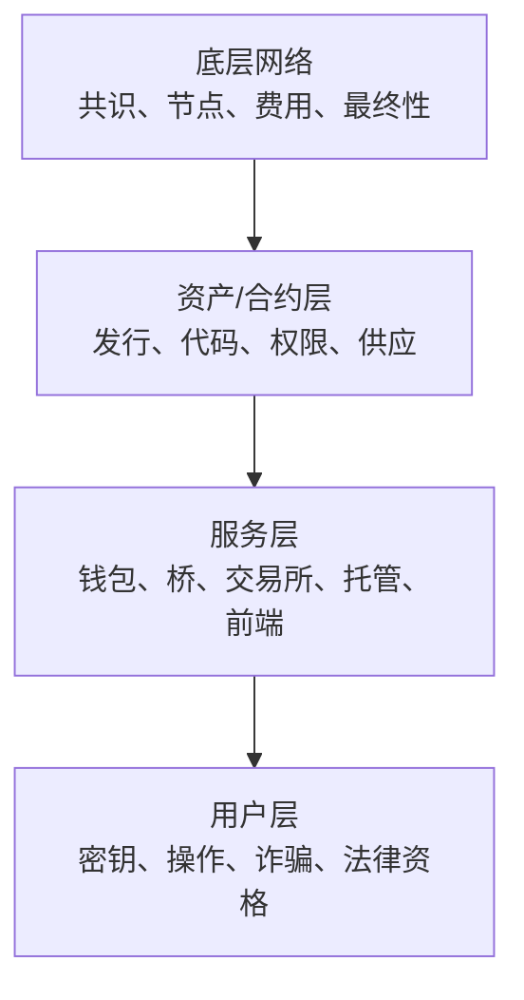

# 课次 11：横向比较与情景题

资料核对日期：2026-08-29

建议用时：75 分钟

> 本课比较机制和信任假设，不给资产排序，也不回答“应该买哪个”。法币储备型稳定币一栏描述的是资产类别；具体 USDT、USDC 仍要使用课次 9 的发行方条款分别核对。

## 本课要解决的问题

怎样用同一把尺子比较 BTC、ETH 和法币储备型稳定币，而不是只看价格？

学完后，你应该能做到：

1. 用统一维度比较不同资产；
2. 区分网络安全、资产发行与应用风险；
3. 把具体使用情景映射到机制需求；
4. 明确不同模型不能互相替代的原因；
5. 将事实、动态观察和判断分栏记录；
6. 发现信息不足时写出下一步核验路径。

## 75 分钟安排

| 时间 | 内容 | 产出 |
| --- | --- | --- |
| 0～12 分钟 | 复习七维框架 | 三张卡校正 |
| 12～32 分钟 | 完成横向比较 | 一页比较表 |
| 32～47 分钟 | 分层信任与失败方式 | 风险链图 |
| 47～65 分钟 | 三个情景题 | 需求—机制分析 |
| 65～75 分钟 | 反例与口头复述 | 五分钟讲解稿 |

## 一、比较前先确定对象

比较必须保持层级一致：

- BTC：Bitcoin 网络的原生资产；
- ETH：Ethereum 网络的原生资产；
- 法币储备型稳定币：某发行方在一条或多条链上发行的 token，对链外储备与赎回安排有依赖。

不能把“Bitcoin 网络”直接与“USDC 某个合约”比较后得出整体优劣；也不能把 Ethereum 应用漏洞当成 ETH 共识必然失效。先写清网络、资产、合约、发行方和托管平台的层次。

## 二、参考比较表

先遮住“参考要点”，独立填写，再用于核对。

| 维度 | BTC | ETH | 法币储备型稳定币 |
| --- | --- | --- | --- |
| 首要目标 | 无中央总账的点对点价值转移与稀缺原生资产 | 可编程状态与通用链上执行 | 相对法币单位保持稳定、便于链上转移与结算 |
| 资产类型 | Bitcoin 原生资产 | Ethereum 原生资产 | 发行方 token / 有条件赎回安排 |
| 安全来源 | PoW、完整节点验证、累计工作量 | PoS、执行验证、证明与经济最终性 | 所在链安全 + token 合约 + 发行方/储备体系 |
| 交易模型 | UTXO | 账户与 EVM 状态 | 依所在链；余额常在 token 合约状态 |
| 发行与供应 | 补贴按规则减半，渐近上限 | 验证者发行与费用销毁共同决定净变化 | 发行方按收付/条款铸销，需与储备负债对应 |
| 费用支付 | BTC，按交易体积与费率竞争 | ETH，按 Gas 与费用市场 | 通常用所在链原生资产；可有代付机制 |
| 必须信任 | 共识实现、节点/矿工生态、自身托管 | 客户端、验证者生态、合约与应用 | 再加发行方、银行、托管、法律、赎回与冻结权限 |
| 最终性 | 概率性确认 | 检查点经济最终性 | 继承所在链确认，同时受发行方最终结算影响 |
| 典型失败 | 密钥/托管、重组、软件分歧、市场波动 | 合约、客户端、验证者集中、L2/桥、MEV | 脱锚、赎回、储备、冻结、链/桥、流动性 |

表中内容是课堂级概括，具体情景必须继续展开。例如“BTC 有上限”不回答托管风险，“USDC 在 Ethereum 上”也不表示 Circle 储备由 Ethereum 验证。

## 三、三层风险链



分析一项损失时，要问失败发生在哪层：

- Bitcoin 仍出块，但托管平台拒绝提现：服务层失败；
- Ethereum 正常，但某 token 合约被攻击：资产/合约层失败；
- 稳定币发行方可兑，但第三方桥资产失去支撑：桥接服务层失败；
- 用户泄露私钥：用户控制层失败。

底层网络正常不能自动保护上层；上层失败也不一定证明底层共识失效。

## 四、不要用单一指标替代分析

以下指标都只能回答部分问题：

- **市值**：价格乘估计供应，不能证明流动性、储备或安全；
- **交易量**：可能受统计口径和刷量影响，不说明赎回权；
- **持币地址数**：一人可多地址，平台可代表多人；
- **节点/验证者数量**：还需看集中度、实现多样性和权重；
- **年化收益率**：不包含资产价格、罚没、合约和对手方风险全貌；
- **历史稳定**：不能保证未来压力情景；
- **品牌知名度**：不能替代条款、合约与证据。

## 五、情景 1：验证无需发行方承诺的稀缺数字资产

先研究：

1. 供应规则由谁执行，节点能否验证；
2. 历史排序与重组成本；
3. 资产能否在没有发行方赎回承诺下转移；
4. 自托管与完整验证可行性；
5. 软件、算力集中和长期安全预算；
6. “稀缺”是否只是代码声明，还是有广泛节点执行。

这里 BTC 是重要研究对象，但“符合机制需求”仍不推出价格稳定或适合持有。

## 六、情景 2：运行链上程序

需要研究：

1. EVM/虚拟机能执行哪些状态转换；
2. 合约代码、权限、升级和预言机；
3. 费用以什么原生资产结算；
4. L1 与 L2 的执行、数据和结算关系；
5. 应用 token 是否只是合约状态；
6. 即便由 paymaster 代付，底层费用最终由谁承担。

仅持有应用 token 不自动获得 Ethereum 区块空间。传统用户通常需要 ETH 支付 Gas；账户抽象可能隐藏或代付，但没有消除底层成本。

## 七、情景 3：短期美元计价媒介

需要研究：

1. 锚定对象与发行法律主体；
2. 储备组成、托管、鉴证和流动性；
3. 谁能直接赎回及限制；
4. 所在网络和官方合约；
5. 原生还是桥接版本；
6. 冻结、平台暂停和监管风险；
7. 自己所处地区和平台的实际权利。

相对美元稳定只减少一个维度的波动，不能替代信用和技术尽调。

## 八、事实—观察—推断表

任何比较结论都按下面格式记录：

```markdown
| 陈述 | 类型 | 来源/日期 | 依赖的假设 | 如何证伪 |
| --- | --- | --- | --- | --- |
| BTC 补贴每 210,000 区块减半 | 协议事实 | | | |
| ETH 某期间净供应减少 | 动态观察 | | | |
| 某稳定币适合所有人作美元现金替代 | 过强推断 | | | |
```

若一句话同时包含事实和推断，应拆成两句。

## 九、课后输出

1. 独立重做一页比较表，不照抄参考答案；
2. 每类资产写一个底层风险、一个资产层风险、一个服务层风险；
3. 对三个情景分别写“需要的性质、候选机制、额外风险、缺失信息”；
4. 用 5 分钟口头讲解，不提价格预测。

记录到 [`../../learning-log.md`](../../learning-log.md)。

## 十、检查问题

1. 为什么 BTC 的供应上限不能回答托管平台是否安全？
2. 为什么 Ethereum 正常出块不能证明某 DeFi 合约安全？
3. 稳定币继承所在链最终性后，为什么仍有发行方风险？
4. 同一笔稳定币转账的费用为什么取决于所在网络？
5. 市值为什么不能证明稳定币储备足额？
6. 账户抽象是否消除了 ETH 的底层费用作用？
7. 情景分析与投资推荐的边界在哪里？

<details>
<summary>完成后展开答案要点</summary>

1. 供应规则属于协议层，平台保管与兑付属于服务/对手方层。
2. 合约有独立代码、权限、预言机和经济风险。
3. 链只确认 token 状态，链外储备、赎回和冻结由发行体系决定。
4. 每条网络有自己的资源计量、拥堵和原生费用资产。
5. 市值是市场价格与供应估算，不能验证链外资产和法律权利。
6. 没有；它可隐藏或代付用户体验，底层资源仍需以协议方式结算。
7. 前者说明机制是否匹配需求和风险；后者还要结合个人财务并给出买卖判断，本课程不做后者。

</details>

## 十一、完成标准

- [ ] 独立完成全表且没有价格预测；
- [ ] 能按四层定位风险；
- [ ] 三个情景都写出缺失信息；
- [ ] 动态观察带日期和来源；
- [ ] 能在 5 分钟内口头比较三类资产；
- [ ] 检查题至少答对 6 题。

## 十二、复习资料

- [课次 3：BTC 的 PoW、供给与风险](lesson-03-btc-pow-supply-risks.md)
- [课次 7：PoS、ETH 供给与风险](lesson-07-ethereum-pos-supply-risks.md)
- [课次 8：稳定币分类与稳定机制](lesson-08-stablecoin-models.md)
- [课次 9：USDT 与 USDC 的尽调方法](lesson-09-usdt-usdc-due-diligence.md)
- [第二阶段统一分析框架](../../stage-02-mainstream-assets.md#3-统一分析框架)
