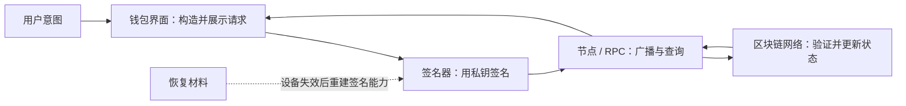

# 第一单元讲义：建立钱包安全模型

对应课次：1～4

资料核对日期：2026-08-30

建议用时：4～5 小时，分四次完成

> 本单元只做阅读、纸面推演和只读观察。不要创建钱包，不要生成、导入、展示或检查助记词，不要连接网站或签名。示例中的人物、地点、资产等级和标识都必须是虚构的。

## 本单元要解决的问题

钱包安全不是“买一个安全设备”这么简单。真正的问题是：谁有权签名、设备坏了靠什么恢复、哪些外围系统可能绕过你的设计，以及怎样避免在防盗的同时把自己永久锁在外面。

学完后，你应该能够：

1. 区分托管、自托管、热钱包、签名设备、观察钱包和链上资产；
2. 画出从私钥到地址、从恢复材料到多个账户的关系；
3. 把信息分为公开、隐私敏感和可直接取得控制权三类；
4. 用威胁模型比较方案，不用“绝对安全”评价产品；
5. 设计不含真实秘密和地点的备份、恢复与继承方案；
6. 说明一项控制减少了什么风险，又引入了什么新风险。

## 一、钱包不是装币的容器

### 1. 把五个组件拆开

| 组件 | 主要作用 | 失效时可能发生什么 |
| --- | --- | --- |
| 链上网络 | 按协议维护资产状态和交易历史 | 网络中断、重组、费用变化，但不会因为删除钱包应用而删除链上记录 |
| 钱包界面 | 显示账户、构造请求、帮助用户选择网络和费用 | 显示错误、被替换、诱导用户批准错误内容 |
| 签名器 | 保管或调用私钥，对确定的数据签名 | 私钥泄露、设备损坏、盲签、固件或实现问题 |
| 节点/RPC | 向钱包提供链上状态并广播交易 | 返回过时或错误数据、泄露查询关联、不可用 |
| 备份与恢复材料 | 在原设备不可用时重建签名能力 | 丢失导致无法恢复；泄露可能让别人恢复同一控制权 |

“余额”是钱包根据链上状态形成的视图。删除界面不会销毁链上资产，但如果签名能力及其备份都丢失，资产可能仍在链上却无人能再满足花费条件。



每条箭头都是信任边界。签名器没有联网，不代表进入它的数据正确；钱包显示正确，也不代表 RPC 返回的信息完整；备份可恢复，也不代表备份没有被别人复制。

### 2. “拥有资产”在不同模式下意味着什么

- 托管模式：平台或托管人控制链上密钥，用户通常用平台账户发出内部指令。用户依赖平台认证、内部账本、提现政策、运营能力和法律安排。
- 自托管模式：用户掌握满足链上花费条件所需的密钥或签名门槛。用户减少了对单一平台的依赖，同时承担备份、恢复、防钓鱼和操作责任。
- 混合模式：例如多方共同批准、社交恢复或服务参与恢复。它既不是纯托管，也不是“只有一个人和一串词”，必须逐项分析参与者的权力。

托管与自托管不是道德高低，而是风险重新分配。平台账户可能通过身份审核恢复；自托管密钥通常没有中央重置入口。反过来，平台可以暂停提现，自托管签名权通常不依赖平台内部许可。

## 二、用威胁模型代替“哪个最安全”

### 1. 五步威胁模型

1. **保护对象**：签名权、恢复能力、交易隐私、可用性，还是所有这些？
2. **可能事件**：设备损坏、恶意软件、钓鱼、备份被盗、本人遗忘、平台冻结、自然灾害、被胁迫或继承失败。
3. **攻击者能力**：只有网络访问，还是能接触设备、住处、邮箱、电话或合作签名人？
4. **已有控制**：隔离设备、唯一密码、抗钓鱼认证、异地备份、多人门槛、延迟与人工复核。
5. **残余风险与恢复**：控制失效后谁先发现、怎样验证、还能靠什么恢复？

不要把攻击者写成“黑客”就结束。能发钓鱼邮件的人、能拿到旧手机的人、能胁迫持有人面对面签名的人，需要完全不同的控制。

### 2. 风险、控制和副作用

| 风险 | 一个可能的控制 | 控制的副作用 |
| --- | --- | --- |
| 手机丢失 | 设备锁定、钱包加密、远程账户防护 | 忘记凭据或恢复链断裂可能降低可用性 |
| 在线恶意软件 | 独立签名设备 | 仍需正确核对设备屏幕；增加供应链与备份责任 |
| 单份备份毁坏 | 异地第二份备份 | 多一个被发现或复制的地点 |
| 单人失能 | 继承说明或多人恢复 | 更多参与者知道方案，协调和隐私风险增加 |
| 平台冻结 | 自托管或多平台分散 | 个人操作、密钥和合规责任增加 |

安全设计的目标不是让一列风险全部变成零，而是在明确约束下控制最重要的失败方式。

### 3. 热、冷和签名专用是运行状态

“热”通常表示密钥在联网或经常联网的通用环境中可用；“冷”强调密钥生成、保存或签名与网络隔离。它们不是产品贴纸，也不是永久身份：

- 一台离线生成密钥、后来安装了不可信软件的旧手机，不会因为关闭 Wi-Fi 就自动可信；
- 硬件钱包通常是签名专用设备，但它仍接收外部构造的交易数据；
- 观察钱包可查询地址和构造未签名交易，却不应持有花费私钥；
- 数据用 USB、二维码或其他介质跨越隔离边界时，仍可能携带恶意输入或泄露信息。

[Bitcoin 钱包开发指南](https://developer.bitcoin.org/devguide/wallets.html)把分发公钥、签名和联网广播描述为可以分离的角色。这个结构有助于理解冷签名，但并不构成对某个实现的安全保证。

## 三、私钥、地址、签名和密码各自做什么

### 1. 从授权关系理解，而不是背名词

```text
私钥 --单向推导--> 公钥 --编码/哈希等规则--> 地址或花费条件标识
私钥 + 待签数据 --签名算法--> 签名
公钥/地址关系 + 待签数据 + 签名 --验证--> 是否由相应密钥授权
```

这张图只表达逻辑关系。Bitcoin 和 Ethereum 的地址构造、交易结构和验证规则并不完全相同。

- 私钥：产生签名的秘密。泄露后，攻击者不需要原设备或钱包密码也可能取得控制权。
- 公钥/地址：用于验证或定位控制关系。通常可以收款和查询，但公开会暴露隐私与账户关联。
- 签名：对具体数据的密码学授权。有效签名只能说明对应密钥签了这些数据，不能说明网页诚实、资产会升值或合约安全。
- 钱包密码/PIN：通常保护本地应用、设备解锁或密钥文件使用。它不等于链上私钥，也往往不能在设备和备份同时丢失时恢复钱包。
- 平台密码与 MFA：保护托管平台账户。它们影响平台是否接受用户指令，但不是区块链私钥。

### 2. 信息分级

| 级别 | 示例 | 泄露后果 | 处理原则 |
| --- | --- | --- | --- |
| 可公开但需核对 | 协议规范、公开合约地址 | 伪造来源可能诱导错误操作 | 从一手来源核对 |
| 隐私敏感 | 自己的地址、完整交易 ID、扩展公钥、余额与时间规律 | 账户聚类、跟踪、定向诈骗；某些扩展密钥还有派生相关风险 | 最少披露，不写入公开学习材料 |
| 可直接取得控制权 | 私钥、根种子、助记词、可解密钱包备份及其凭据 | 恢复或签名，可能造成不可逆损失 | 不拍照、不上传、不发给任何人或网站 |
| 本地访问凭据 | 钱包密码、设备 PIN、恢复码 | 取决于是否同时取得设备或账户 | 唯一保存，和秘密备份分层管理 |

“不能花费”不等于“可以随便公开”。例如扩展公钥可用于观察一组派生地址，会显著扩大隐私暴露；不理解具体格式时，按敏感信息处理。

## 四、HD 钱包与助记词：一份根秘密，多条派生路径

### 1. BIP-32 解决什么问题

[BIP-32](https://bips.dev/32/)定义分层确定性钱包：从根材料确定性派生一棵扩展密钥树。它让钱包可以：

- 用一份根备份重建许多后续密钥；
- 按账户、用途或地址分层；
- 在某些非硬化派生层级只用扩展公钥生成子公钥，支持观察与收款而不暴露私钥。

这并不意味着“只要有根词，任何钱包都一定自动显示相同结果”。钱包还要对派生路径、账户索引、地址/脚本类型和网络作出相同选择。

### 2. BIP-39 助记词的角色

[BIP-39](https://bips.dev/39/)描述一种常见流程：

```text
随机熵 + 校验位 -> 助记词
助记词 + 可选 passphrase -> 512 位种子
种子 -> 交给 HD 钱包派生密钥
```

重要边界：

- 助记词是高敏感秘密的可读表示，不是“安全问题答案”；
- 校验位主要帮助发现部分抄写错误，不会阻止别人使用正确助记词；
- BIP-39 的每一个 passphrase 都会产生一个有效种子，输入错误通常不会出现统一的“密码错误”提示，而是得到另一棵钱包树；
- BIP-39 是广泛使用的规范，但不是所有钱包、所有备份格式和所有链的唯一方案；
- 不要把任何助记词输入在线生成器、所谓校验网站、聊天机器人或远程支持界面。

### 3. 恢复需要哪些材料

| 类别 | 可能内容 | 是否秘密 |
| --- | --- | --- |
| 根秘密 | 助记词、种子、主私钥或专有备份 | 是 |
| 附加秘密 | BIP-39 passphrase、备份解密凭据 | 是 |
| 钱包元数据 | 钱包实现/版本、网络、账户序号、派生路径、地址或脚本类型 | 通常不是花费秘密，但具有隐私与恢复敏感性 |
| 多方配置 | 门槛、各 cosigner 扩展公钥、descriptor、恢复角色 | 部分公开、部分敏感；需按具体方案判断 |
| 可重查数据 | 区块历史、公开交易状态 | 链上公开，但查询会产生隐私关联 |

恢复的目标不是“软件接受了这些词”，而是重新得到预期网络上的预期地址和签名能力。

## 五、备份是在可用性与保密性之间做工程设计

### 1. 六类必须推演的故障

1. 当前设备损坏或遗失；
2. 钱包应用误删或升级失败；
3. 单份备份遭遇火灾、水灾或介质老化；
4. 备份被陌生人、熟人或服务商看到；
5. 持有人忘记 passphrase、位置或恢复顺序；
6. 持有人失能或去世，合法继承者无法理解或验证方案。

同一方案在不同故障下可能表现相反。例如，把两份完整明文备份放在异地提高灾害恢复能力，却增加两个泄露点。把唯一备份藏得无人知道，能降低日常发现概率，却可能让继承和本人记忆成为单点故障。

### 2. 不要自创密码学

把助记词手工拆成两半、改写几个词、按自创顺序排列，常见问题包括：

- 任一半丢失就无法恢复；
- 单份可能透露足够结构，降低攻击成本；
- 多年后本人忘记规则；
- 继承者无法分辨故意变形和抄写错误；
- 从未在真实恢复软件中验证过。

如果未来确实需要多方门槛、标准化秘密共享或复杂继承，应先明确威胁模型，选择经过公开审查且受钱包支持的方案，并用无价值练习钱包完成端到端恢复测试。本阶段只做纸面比较，不实施复杂方案。

### 3. 无秘密备份架构模板

```markdown
| 代号 | 保存内容类别 | 能否单独控制 | 保护方式 | 可用性风险 | 泄露风险 | 验证频率 |
| --- | --- | --- | --- | --- | --- | --- |
| A | 根秘密副本 | 待分析 | 仅写控制类型，不写地点 | | | |
| B | 非秘密恢复说明 | 否 | | | | |
| C | 第二恢复角色 | 待分析 | | | | |
```

仓库中只能保存这类架构，不得写真实位置、真实联系人、序列号、地址或秘密内容。

## 六、四课练习与输出

### 课次 1 输出：三种虚构角色的威胁模型

| 项目 | 只学习的新人 | 高频链上用户 | 低频长期保存者 |
| --- | --- | --- | --- |
| 保护对象 | | | |
| 首要攻击面 | | | |
| 可承受中断时间 | | | |
| 主要控制 | | | |
| 新增副作用 | | | |
| 失败后恢复 | | | |

### 课次 2 输出：信息分级卡

至少分类：地址、公钥、扩展公钥、交易 ID、钱包密码、设备 PIN、平台密码、MFA 恢复码、私钥、助记词、passphrase、钱包备份。

### 课次 3 输出：恢复依赖图

用虚构代号画出“根秘密 → 种子 → 派生路径 → 账户 → 地址”，旁边列出网络、钱包类型、账户序号与地址/脚本类型。不要填任何真实值。

### 课次 4 输出：故障矩阵

| 故障 | 是否仍可恢复 | 是否可能失守 | 首个发现信号 | 需要改进 |
| --- | --- | --- | --- | --- |
| 设备损坏 | | | | |
| 单份备份毁坏 | | | | |
| 一份备份被复制 | | | | |
| 忘记附加口令 | | | | |
| 本人失能 | | | | |

## 七、单元检查

闭卷回答，每题 0～2 分：

1. 删除钱包应用为什么不会删除链上资产，却仍可能造成无法恢复？
2. 托管与自托管分别把哪些权力和责任交给谁？
3. 硬件签名器主要隔离什么，不能自动验证什么？
4. 地址、钱包密码、私钥和助记词的泄露后果有什么区别？
5. 为什么扩展公钥应按隐私敏感信息处理？
6. HD 钱包为什么既简化备份，又引入派生和兼容性问题？
7. passphrase 输错为什么可能出现一个空钱包，而不是错误提示？
8. 一份好备份怎样同时讨论“自己拿不到”和“别人拿到”？

至少 13/16，且第 4、6～8 题不得为 0。未通过时不要进入第二单元的签名和权限分析。

## 八、完成标准

- [ ] 能独立画出钱包组件与信任边界；
- [ ] 完成三类虚构角色的威胁模型；
- [ ] 完成信息分级卡，未包含任何真实秘密或账户标识；
- [ ] 能解释 BIP-32、BIP-39 和派生元数据各自的角色；
- [ ] 完成备份架构与五类故障矩阵；
- [ ] 单元检查达标；
- [ ] 全程没有创建钱包、生成助记词、连接网站或签名。

## 九、核心资料

- [Bitcoin Developer Guide：Wallets](https://developer.bitcoin.org/devguide/wallets.html)
- [BIP-32：Hierarchical Deterministic Wallets](https://bips.dev/32/)
- [BIP-39：Mnemonic Code for Generating Deterministic Keys](https://bips.dev/39/)
- [BIP-174：Partially Signed Bitcoin Transaction](https://bips.dev/174/)——用于理解构造、签名和广播可以分离，本单元不要求实际创建 PSBT。
- [第三阶段总计划](../../stage-03-wallet-security.md)
