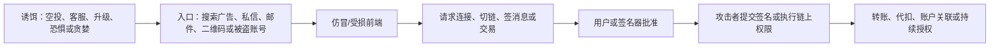
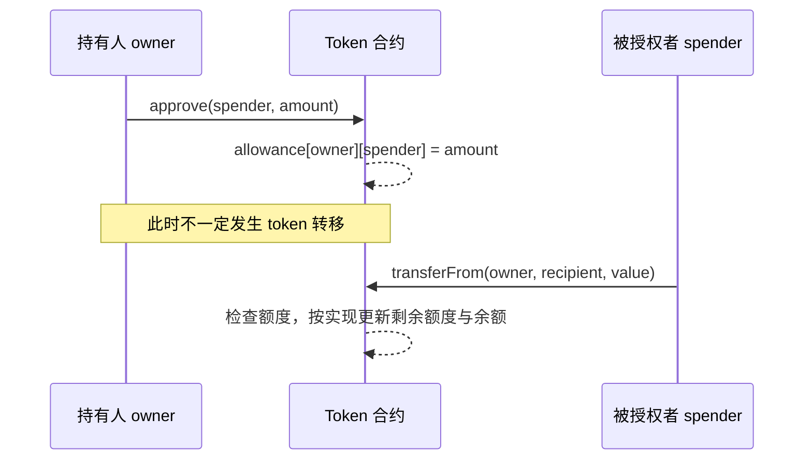

# 第二单元讲义：防住外围系统与恶意交互

对应课次：5～8

资料核对日期：2026-08-30

建议用时：4～5 小时，分四次完成

> 本单元仍然只做账户检查、纸面推演和区块浏览器只读观察。不要连接钱包，不要签消息或交易，不要撤销真实授权，也不要用自己的地址、账户截图或可识别交易作为案例。

## 本单元要解决的问题

私钥可以从未离开设备，资产仍然可能因为用户批准了错误数据而失去控制。外围账户被接管、网页遭替换、假客服制造紧迫感、钱包无法解释待签数据，都可能把一次“用户主动确认”变成攻击的最后一步。

学完后，你应该能够：

1. 画出从诱饵到链上后果的完整攻击链；
2. 为邮箱、密码管理器、设备和软件下载建立分层防护；
3. 区分连接、暴露账户、签消息、发交易、token 授权和实际代扣；
4. 看懂交易与 EIP-712 消息中的关键授权字段；
5. 解释 `approve`、`allowance`、`transferFrom` 与 `permit` 的因果关系；
6. 建立可执行的“停—查—读—拒—报”流程；
7. 通过签名前安全门，在进入实验室之前形成拒绝能力。

## 一、攻击通常是一条链，而不是一个弹窗



只防其中一步往往不够：

- 域名正确，前端仍可能被供应链或管理账户攻破；
- 钱包是正版，仍可能忠实签署恶意网页构造的数据；
- 硬件设备保护私钥，仍可能显示一个用户没有认真核对的恶意目标；
- 当前没有转账，签名可能被攻击者稍后提交；
- 网站断开了，链上的 token allowance 可能仍然存在。

安全流程需要在入口、请求解释、签名前核对和事后权限四个位置都设置停止点。

## 二、课次 5：外围账户与设备是钱包安全的一部分

### 1. 为什么邮箱和密码管理器是高价值目标

邮箱可能接收登录提醒、密码重置和平台恢复邮件；密码管理器集中保存唯一密码和恢复信息；手机号码可能参与短信验证或账户找回。它们不直接等于链上私钥，却可能让攻击者：

- 接管托管平台账户；
- 替换或批准软件安装；
- 删除安全通知；
- 冒充本人联系支持人员；
- 找到钱包使用习惯并发起定向钓鱼。

因此外围账户至少要做到：唯一随机密码、可靠的密码管理方式、独立恢复通道、登录提醒和尽可能抗钓鱼的多因素认证。

### 2. MFA 强度不只看“有几个因素”

[NIST SP 800-63B-4](https://pages.nist.gov/800-63-4/sp800-63b.html)指出，手工输入的一次性验证码不应被视为抗钓鱼，因为仿冒站点可以实时转发用户输入。WebAuthn/FIDO 等方式可把认证绑定到验证者名称或会话，减少把有效凭据交给仿冒域名的机会。

| 方式 | 能减少什么 | 主要边界 |
| --- | --- | --- |
| 短信验证码 | 仅有密码时的部分账户接管 | SIM 换卡、短信拦截、实时钓鱼，不是抗钓鱼方式 |
| TOTP | 避免依赖短信网络 | 仍可被实时仿冒站点转发；恢复种子也需保护 |
| 推送确认 | 操作方便，可附带设备信息 | 疲劳轰炸、含糊提示和误点；实现差异很大 |
| WebAuthn/FIDO 安全密钥或通行密钥 | 把认证与正确站点绑定，具备抗钓鱼能力 | 设备恢复、同步生态、备用认证器和账户恢复仍要设计 |

“TOTP 次于抗钓鱼认证”不是说 TOTP 毫无价值，而是不能把它描述成能抵抗所有仿冒站点。

### 3. 软件来源与更新链

安装或更新钱包时，至少核对：

1. 从预先保存的官方入口进入，不从搜索广告、私信或邮件按钮直接下载；
2. 域名、应用发布者、包名和版本是否与官方说明一致；
3. 项目如果发布签名或哈希，是否用独立取得的验证信息核对；
4. 权限是否与功能相称，是否突然要求远程控制、关闭安全软件或导入旧钱包；
5. 更新说明和官方渠道是否提到迁移；“立即迁移否则资产消失”是高风险话术。

哈希只能说明下载文件与某个哈希匹配；如果哈希和文件来自同一个被攻破页面，独立性不足。数字签名也需要先确认签名者密钥的来源。

### 4. 设备基线

- 使用受支持的系统版本并及时安装安全更新；
- 开启锁屏和磁盘加密，避免无人看管时直接读取本地数据；
- 删除不需要的浏览器扩展和远程控制软件；
- 不在屏幕共享、直播、公共摄像头或陌生人可拍摄环境中处理恢复材料；
- 日常浏览与钱包交互分离能减少攻击面，但浏览器配置文件隔离不等于操作系统级隔离；
- 不把剪贴板、输入法、二维码扫描器或 USB 介质当作天然可信通道。

[CISA Secure Our World](https://www.cisa.gov/secure-our-world)把识别钓鱼、强密码、MFA 和及时更新列为通用网络安全基本动作。这是基础控制，不替代钱包的签名前核对。

## 三、课次 6：社会工程的目标是绕过判断

### 1. 六类常见剧本

| 剧本 | 施压方式 | 真正目标 | 默认动作 |
| --- | --- | --- | --- |
| 假客服 | “账户异常，我来帮你同步” | 索取秘密、验证码、远程控制或诱导签名 | 停止私聊，从官方帮助入口重新开始 |
| 双倍返还/赠币 | 贪婪与名人背书 | 先转账或连接恶意站点 | 不付款、不连接，核查官方安全公告 |
| 空投/未知 token | 免费领取与错失恐惧 | 恶意 approve、permit 或交易 | 不从资产备注或 token 链接进入 |
| 紧急升级/迁移 | 倒计时与资产冻结威胁 | 导入助记词、安装恶意软件 | 独立核对协议和钱包官方公告 |
| 朋友账号求助 | 熟人信任与紧迫感 | 转账、验证码或代操作 | 用原有第二渠道联系本人 |
| 恢复/追款服务 | 已受损后的焦虑 | 二次收费、秘密或身份材料 | 不承诺付款，核验执法/法律/平台正式渠道 |

### 2. 为什么常见“可信标志”不够

- HTTPS 小锁：说明连接到了证书对应的域名，不说明域名属于正确组织，也不说明业务善意；
- 蓝色认证标记：账号可能被盗，认证规则也不是安全审计；
- 搜索排名靠前：可能是广告或 SEO 操纵；
- 开源：代码公开不等于已审计，也不证明下载二进制来自该源码；
- 大量粉丝或群友附和：账号和互动都可购买、伪造或被接管；
- 钱包弹窗：证明请求到达钱包，不证明请求符合你的意图。

### 3. 独立核验的含义

“问对方这是不是官方”不是独立核验。正确做法是切断攻击者提供的路径：

1. 不点原消息里的链接和联系方式；
2. 从之前保存的书签、协议规范、应用商店发布页或已知官方主页重新进入；
3. 用另一种通道核对，例如官网公告加官方代码仓库发布，而不是同一条社媒帖的评论区；
4. 把要求拆成事实：是否真的有升级、当前版本是什么、是否需要用户动作、动作会授权什么；
5. 无法确定时保持不操作。错过一次活动通常可接受，失去签名权可能不可逆。

### 4. “停—查—读—拒—报”

- 停：停止点击、输入、下载、共享屏幕和签名；
- 查：从独立官方入口核对主体、域名、版本、网络和事件；
- 读：读钱包最终显示的请求，而不是网页按钮；
- 拒：任何秘密、远控、付款、未知签名或无法解释的请求都拒绝；
- 报：保留不含秘密的时间、域名、消息来源和截图，向平台正式渠道或适当机构报告。

真实资产已经处于风险时，响应可能涉及撤销权限或转移资产。这些是外部状态变更，不作为课程练习；应先确定网络、账户、证据和风险，再单独获得明确授权。

## 四、课次 7：钱包到底在请求什么

### 1. 从低到高区分五类动作

| 动作 | 常见结果 | 是否必然上链 | 主要风险 |
| --- | --- | --- | --- |
| 只读访问网页 | 网站读取公开内容 | 否 | 跟踪、恶意内容、后续诱导 |
| 请求账户访问/连接 | 网站获知所选地址并可发起后续请求 | 否 | 隐私关联、把恶意来源加入信任流程 |
| 切换/添加网络 | 钱包改变请求指向的 chain | 否 | 假 RPC、错链、同名资产误认 |
| 签消息 | 产生可由第三方验证或提交的签名 | 不一定 | 登录冒用、授权、重放或被合约消费 |
| 签交易 | 授权链上状态转换 | 通常会广播或交给他人广播 | 转账、合约调用、授权、费用与不可逆状态变化 |

[EIP-1193](https://eips.ethereum.org/EIPS/eip-1193)把注入网页的 Provider 视作处于不可信环境，并强调账户暴露与 chain ID 的正确处理。[EIP-2255](https://eips.ethereum.org/EIPS/eip-2255)进一步描述钱包请求和查询权限的接口。它们说明“连接”是一类接口权限，不是 `approve` 的同义词。

### 2. Ethereum 交易核对表

对每个待签交易，至少回答：

1. 当前网络与 chain ID 是什么？
2. 哪个账户发起？
3. 动作是原生币转账还是合约调用？
4. `to` 是收款地址、token 合约还是应用合约？
5. `value` 转移多少原生 ETH？
6. `data` 是否为空；若非空，钱包如何解释方法和参数？
7. 涉及哪个 token、数量和 spender？
8. Gas limit、预估费用和费率是否合理，失败也可能消耗多少？
9. nonce 和有效期是否符合预期？
10. 签名设备最终显示的目标、金额和方法是否与独立来源一致？

其中任一项无法解释时，安全答案是拒绝，不是“先签了再去浏览器看”。

### 3. 消息签名不是无害签名

[EIP-712](https://eips.ethereum.org/EIPS/eip-712)让应用用结构化字段描述待签消息，并可通过 domain 放入名称、版本、chain ID 和 verifying contract。它改善可读性和域分离，但有三个边界：

- 结构化展示正确，不代表业务意图善意；
- 标准本身不阻止所有重放，应用必须正确使用 nonce、有效期和域；
- 钱包如果不能清楚解释字段，用户仍可能处于盲签状态。

截至 2026-08-30，以太坊基金会正在推动[明文签名（Clear Signing）](https://blog.ethereum.org/zh/2026/05/12/clear-signing-announcement)，目标是让钱包以可理解方式显示交易含义。这是正在演进的安全基础设施，不能被写成“使用了该标准就绝对安全”。

## 五、课次 8：连接、授权和代扣是不同状态

### 1. ERC-20 allowance 的状态变化



[ERC-20](https://eips.ethereum.org/EIPS/eip-20)中的关键关系：

- `approve` 的调用目标是具体 token 合约；
- `spender` 是将来可调用 `transferFrom` 的地址；
- `amount` 是可使用额度；
- `allowance(owner, spender)` 是链上状态；
- `transferFrom` 在余额和额度等条件满足时执行代扣。

常见实现会随代扣减少剩余额度；部分实现对最大值等特殊额度有优化。判断具体行为时仍要读目标 token 的实现，不能只凭界面推断。

所以“没有马上转账”不等于“没有创建未来权力”。无限额度减少重复授权交易，却扩大 spender 或其控制逻辑失守后的暴露面。

### 2. permit 为什么没有 Gas 也有权限后果

[ERC-2612](https://eips.ethereum.org/EIPS/eip-2612)让 owner 用 EIP-712 签名表达对 spender、value、nonce 和 deadline 的许可。签名可以由 relayer 或 spender 提交：

```text
owner 离线签 permit
        ↓
第三方拿到签名
        ↓
第三方在 deadline 前提交给 token 合约
        ↓
合约验证签名和 nonce，更新 allowance
```

用户签名当下可能没有支付 Gas，也可能暂时看不到链上变化，但授权数据已经可被持有者在条件满足时提交。必须核对 token 合约、owner、spender、value、nonce、deadline、chain ID 和 verifying contract。

### 3. 四种“撤销”不要混淆

| 动作 | 改变什么 | 不改变什么 |
| --- | --- | --- |
| 关闭网页 | 当前页面进程 | 钱包内站点权限、链上 allowance |
| 从钱包断开网站 | 站点对账户/Provider 的本地访问关系，具体实现不同 | 已确认交易、链上 allowance、已经给出的可用签名 |
| 将 allowance 设为 0/更小 | 对应 token 合约里的链上额度 | 其他 token、其他 spender、其他链上的额度 |
| 让签名过期或消耗 nonce | 对具体签名方案的可用性 | 已经执行的状态变化；其他签名或权限 |

课程只要求理解和只读核对，不撤销任何真实权限。

## 六、只读练习

### 练习 1：外围系统检查

只记录状态，不记录账户标识、恢复码或设备序列号：

```markdown
| 项目 | 已检查 | 待改进 | 无法确认 | 下一次复核日期 |
| --- | --- | --- | --- | --- |
| 系统更新 | | | | |
| 磁盘加密与锁屏 | | | | |
| 邮箱唯一密码 | | | | |
| 密码管理器恢复 | | | | |
| MFA 类型与备用方式 | | | | |
| 浏览器扩展最小化 | | | | |
| 官方下载书签 | | | | |
```

### 练习 2：六个社会工程情景

每个情景填写：诱因、攻击者目标、不能信的表面信号、独立核验路径、立即拒绝动作、可保存的非秘密证据。

### 练习 3：交易/签名只读审阅

由教师或公开教材提供脱敏样例。只描述网络、账户角色、动作类型、目标、资产、额度/金额、费用、有效期和无法确定之处。不要使用自己的钱包弹窗。

### 练习 4：公开 Approval 事件

选择知名 token 合约的任意公开历史 `Approval` 事件，写出 owner、spender、value 在协议中的角色。输出只用 `OWNER_A`、`SPENDER_B`、`TOKEN_C` 代号，不保留完整地址或交易 ID。

## 七、签名前安全门准备

在进入第三单元前，闭卷完成总计划中的 10 道安全门题。建议再口头完成三个情景：

1. 官方社媒发出紧急钱包更新链接；
2. 网站写“免费登录”，钱包显示 `Permit`、无限 value 和很远的 deadline；
3. 钱包已从网站断开，但区块浏览器仍显示非零 allowance。

每题必须按“已知事实 → 无法确定 → 独立核验 → 接受/拒绝 → 停止条件”回答。只说“我会小心”不得分。

## 八、单元检查

1. 为什么邮箱被接管可能影响托管账户和钱包软件安全？
2. TOTP 增加了哪类保护，为什么仍不是抗钓鱼认证？
3. 官方域名、正版钱包和硬件签名器为什么都不能单独证明交易安全？
4. 连接网站通常暴露或允许什么，和 token allowance 有什么区别？
5. 交易的 `to`、`value` 与 `data` 分别帮助判断什么？
6. EIP-712 改善了什么，没有保证什么？
7. `approve` 后为什么可以暂时没有 token 转移？
8. `permit` 为什么可由第三方支付 Gas 并在稍后提交？
9. 从网站断开与把 allowance 设为零为什么不同？
10. 面对假客服，怎样形成真正独立的核验路径？

每题 0～2 分，至少 16/20；第 4、6～9 题不得为 0。通过本单元检查不等于通过签名前安全门，仍需完成总计划的门槛清单。

## 九、完成标准

- [ ] 完成外围账户与设备基线，日志不含凭据或账户标识；
- [ ] 完成六个社会工程情景；
- [ ] 完成交易/签名十项核对表；
- [ ] 能解释 EIP-1193 连接、EIP-712 消息、ERC-20 allowance 和 ERC-2612 permit 的区别；
- [ ] 只读识别一个公开 Approval 事件；
- [ ] 单元检查达标；
- [ ] 全程未连接钱包、未签名、未改变任何链上或外部账户状态。

## 十、核心资料

- [NIST SP 800-63B-4](https://pages.nist.gov/800-63-4/sp800-63b.html)
- [CISA Secure Our World](https://www.cisa.gov/secure-our-world)
- [Ethereum：Security and scam prevention](https://ethereum.org/security/)
- [EIP-1193：Ethereum Provider JavaScript API](https://eips.ethereum.org/EIPS/eip-1193)
- [EIP-2255：Wallet Permissions System](https://eips.ethereum.org/EIPS/eip-2255)
- [ERC-20：Token Standard](https://eips.ethereum.org/EIPS/eip-20)
- [EIP-712：Typed structured data hashing and signing](https://eips.ethereum.org/EIPS/eip-712)
- [ERC-2612：Permit Extension](https://eips.ethereum.org/EIPS/eip-2612)
- [Ethereum Foundation：明文签名](https://blog.ethereum.org/zh/2026/05/12/clear-signing-announcement)
- [第一单元讲义](unit-01-security-model.md)
- [第三阶段总计划](../../stage-03-wallet-security.md)
