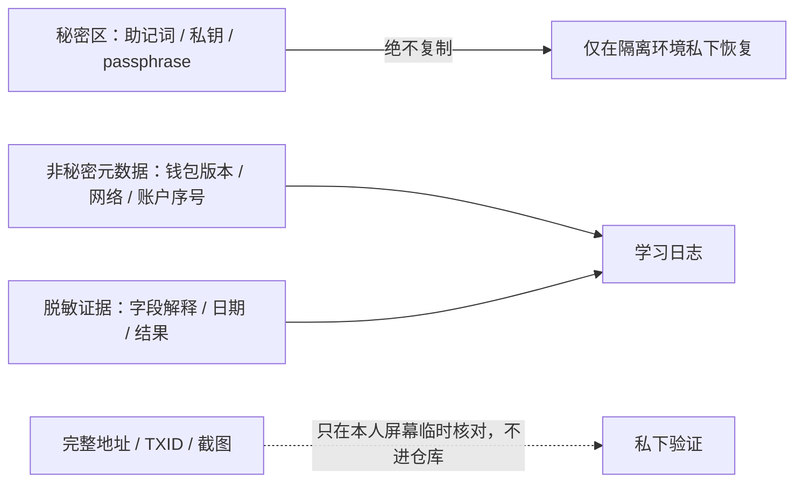

# 第三单元讲义：隔离测试钱包实验室

对应课次：9～11

资料核对日期：2026-08-30

建议用时：4～5 小时，分三次完成

> 只有完成前两个单元、通过第三阶段“签名前安全门”后，才可进行本单元。实验只使用全新、隔离、永久标记为练习用途的钱包和测试网资产。不得导入主网助记词、使用真实资金、购买测试币、连接未知应用或与 token/合约交互。任何一步无法确认边界时，改做纸面演练。

## 本单元要解决的问题

纸面安全方案必须通过恢复测试才知道是否有效；钱包显示“成功”也必须用链上状态核对。本单元把前两单元的概念变成一条可验证的证据链：环境确实隔离、地址确实来自练习钱包、交易确实发生在预期测试网、恢复后确实得到相同账户，同时仓库和聊天中没有出现任何秘密或完整账户标识。

学完后，你应该能够：

1. 区分浏览器配置文件、虚拟机、专用设备和本地开发网络提供的不同隔离层级；
2. 用来源、版本、权限和停止条件筛选练习钱包，而不是依赖品牌口号；
3. 在测试网完成接收、发送和区块浏览器核验；
4. 在第二个临时环境恢复同一练习钱包并验证地址与历史；
5. 按网络、RPC、账户索引、派生路径、地址类型、passphrase 和备份格式排查“余额为零”；
6. 产出可验收但不泄露秘密、地址关联或账户截图的实验记录。

## 一、进入实验室前的硬门槛

逐项确认：

- [ ] 课次 1～8 的输出和单元检查均达标；
- [ ] 总计划的安全门测验至少 16/20，关键题无零分；
- [ ] 能解释连接、签消息、发交易、approve 和 permit 的区别；
- [ ] 能在签名前复述网络、动作、目标、资产、金额/额度、费用和有效期；
- [ ] 准备的环境中没有现有钱包、主网助记词、真实资产或真实账户会话；
- [ ] 已决定实验钱包永不接收真实资产，测试网账户不与主网复用；
- [ ] 已准备一条无需执行也能结束练习的路径：任何疑点都可立即停止并改做纸面演练。

缺一项就不创建钱包。实验不是奖励，也不是必须当天完成的任务。

## 二、课次 9：设计隔离环境

### 1. 隔离层级解决的不是同一种问题

| 方式 | 能隔离什么 | 不能保证什么 | 适用边界 |
| --- | --- | --- | --- |
| 独立浏览器配置文件 | Cookie、扩展、历史和站点权限的一部分 | 不能隔离同一操作系统上的恶意软件、剪贴板或输入法 | 最低限度的网页状态隔离 |
| 新的操作系统用户 | 更多文件、配置和权限边界 | 仍共享内核、硬件和部分系统服务 | 比浏览器配置更强，但不是完整沙箱 |
| 临时虚拟机 | 系统与应用环境可重建、与宿主有较强边界 | 宿主机、共享剪贴板/目录、虚拟化软件仍是信任面 | 适合一次性实验，需关闭不必要共享 |
| 专用测试设备 | 减少日常软件与账户交叉 | 设备来源、系统、网络和物理访问仍需保护 | 可长期复用，但要持续维护 |
| 本地开发网络 | 避免公共链资产和公开交易历史 | 不自动隔离钱包软件或主机恶意软件 | 适合先熟悉界面和签名流程 |

“独立浏览器配置文件”是最低隔离，不应被描述成能抵抗系统级恶意软件。本阶段不要求购买新设备；选择能明确理解、可安全操作的最低复杂度方案。

### 2. 钱包选择核验表

本讲义不固定推荐某一品牌，因为版本、维护状态、下载入口和测试网支持会变化。开始当天核对：

1. 项目或发行方的官方主页和代码/应用商店发布入口；
2. 当前受支持版本、最近安全公告和更新日期；
3. 是否清晰支持选定测试网、账户创建和恢复；
4. 是否能在签名前显示网络、目标、金额和费用；
5. 浏览器扩展或移动应用请求的权限是否与功能相称；
6. 是否要求付费、导入现有钱包、关闭安全软件或使用远程控制；
7. 如何彻底区分练习配置和日常环境；
8. 如何在第二个临时环境恢复，但不破坏原环境。

只记录名称、版本、官方入口和核对日期等非秘密元数据。厂商的安全描述属于厂商声明，不是独立审计结论。

### 3. 当前网络选择

截至 2026-08-30，[Ethereum 官方网络页](https://ethereum.org/developers/docs/networks/)将 Sepolia 列为应用开发的推荐默认测试网，并明确建议主网和测试网不要复用账户。测试网络、浏览器和水龙头会变化，所以操作当天必须重新打开官方页面核验：

- 当前推荐的应用测试网名称；
- 钱包显示的 chain ID 与官方资料是否一致；
- 官方页面当前列出的区块浏览器和水龙头入口；
- 是否出现弃用、迁移或安全公告。

官方页面也提醒，测试 ETH 本应没有真实价值，但现实中可能出现交易市场。课程一律把测试币按零价值处理：只从官方页面当前列出的免费入口申请；不购买、不交换、不因稀缺去陌生群组领取。

### 4. 秘密区和记录区必须分开



测试用助记词仍然是秘密，因为课程训练的是可迁移到真实环境的安全习惯。把它交给聊天机器人“检查拼写”，会直接破坏练习目标。

### 5. 环境核验输出

```markdown
| 项目 | 结果 | 来源/核对日期 | 停止条件 |
| --- | --- | --- | --- |
| 隔离方式 | | | 发现旧钱包或真实账户会话 |
| 钱包官方入口 | | | 来源无法独立确认 |
| 钱包版本 | | | 已停止支持或有未处理安全公告 |
| 目标测试网 | | | 钱包无法清楚显示网络/chain ID |
| 免费测试币入口 | | | 索要付款、秘密或不必要签名 |
| 恢复环境 | | | 需要删除或覆盖现有数据 |
```

## 三、创建一次性练习钱包

完成课次 9 的核验表后才执行：

1. 在隔离环境打开已核验的钱包；
2. 确认选择“创建新钱包”，不是导入、同步或连接已有账户；
3. 将钱包显示名称标为 `TRAINING ONLY / NEVER MAINNET`；
4. 按钱包本地流程生成恢复材料，只在私密、离线位置手工记录；
5. 不截图、不打印到联网打印机、不进入剪贴板、不存邮件/云盘/仓库；
6. 如果钱包要求确认若干单词，只在本地界面完成，不向任何人展示；
7. 创建测试账户 A 和 B，私下完整核对地址；日志只记 `A: 0x12…ABCD` 这类不可用于实际发送的指纹；
8. 记录网络、账户序号、钱包版本等恢复元数据；
9. 未取得测试币前暂停，复述下一课的签名前检查表。

这里的恢复材料只能恢复这个一次性练习钱包。即使实验成功，也不能把它升级为真实资产钱包，因为它已经在练习环境中经历过更多展示和恢复暴露。

## 四、课次 10：测试网接收与发送

### 1. 接收不是“把地址发出去就完成”

申请测试 ETH 前核对：

- 当前仍是官方资料列出的 Sepolia；
- 水龙头入口来自当天打开的 Ethereum 官方网络页；
- 页面只需要测试地址和合理的反滥用步骤；
- 不要求付款、主网余额证明、助记词、私钥、远程控制或无法解释的签名；
- 复制地址后，在钱包接收界面重新核对完整地址，避免剪贴板替换。

部分水龙头可能要求第三方登录或开发者账户。登录要求会增加隐私和账户暴露，不是必须接受的条件；可改用官方页面列出的另一个入口，或者暂停实验。

### 2. 用区块浏览器验证接收

钱包显示余额后，使用官方页面当天列出的区块浏览器只读核对：

- 网络确实是 Sepolia；
- 目标地址与本人屏幕上的 A 完整地址一致；
- 交易状态、区块和时间；
- 收到的是测试 ETH，不是同名 token；
- 钱包余额和浏览器状态的差异是否来自确认、缓存或 RPC 更新延迟。

不要把完整地址、交易 ID 或浏览器截图粘贴到学习日志。验收证据是你能解释字段和核对过程，不是公开账户历史。

### 3. A 向 B 发送的签名前流程

先在纸面填写：

| 核对项 | 本次答案 |
| --- | --- |
| 网络与 chain ID | 只在本人屏幕填写，日志写“已核对” |
| 发起账户 | A（练习） |
| 动作类型 | Sepolia 测试 ETH 普通转账 |
| 目标来源 | 钱包内新建的 B；已在接收界面核对完整地址 |
| 数量 | 极少量测试 ETH，不追求清空 |
| `data` | 普通转账应按钱包显示核对是否为空 |
| Gas 与最高费用 | 能解释估算，不以美元价值衡量 |
| 是否涉及 token/approve/permit | 否；如出现立即停止 |
| 签名器最终显示 | 网络、目标、数量与意图一致 |
| 停止条件 | 任何未知合约、切链、额度或消息签名 |

确认后只签这一笔。不要顺便测试 DApp、token 授权或空投。

### 4. 发送后的链上核验

在钱包和区块浏览器中核对：

1. pending、confirmed/failed 分别表示什么；
2. From 是 A，To 是 B；
3. Value 与预期一致；
4. Input data 与普通转账预期一致；
5. Gas limit、Gas used、实际费率和总费用的关系；
6. nonce 与 A 的交易顺序；
7. B 的余额变化和 A 的余额减少为何还包含费用；
8. 区块浏览器标签哪些是服务方解释，哪些是链上原始字段。

### 5. 脱敏实验记录

```markdown
### YYYY-MM-DD｜Sepolia 收发实验

- 操作当天官方网络页：已核对 / 未通过
- 钱包来源与版本：已核对（不写设备或账户标识）
- 接收：成功 / 失败 / 未执行
- 发送：成功 / 失败 / 未执行
- 我能解释的字段：
- 钱包与浏览器显示差异：
- 签名前发现并拒绝的额外请求：
- 地址记录：仅脱敏指纹，无完整地址
- 交易记录：无完整 TXID、无账户截图
- 秘密检查：未记录或上传任何恢复材料
```

## 五、课次 11：恢复演练

### 1. 不要先破坏原环境

恢复测试的目标是证明备份可用，不是考验自己敢不敢删除数据。使用第二个全新临时环境恢复，保留原练习环境作为对照。不得删除、覆盖或重置任何现有主钱包、密码管理器或真实账户数据。

### 2. 恢复步骤

1. 在原练习环境私下记录 A、B 的完整地址、账户序号、网络和已知测试历史；日志只留脱敏指纹；
2. 建立另一个没有钱包数据的临时配置文件、虚拟机或测试设备环境；
3. 从同一已核验官方来源安装相同钱包版本，或记录版本差异；
4. 选择恢复钱包，只在隔离环境输入练习恢复材料；
5. 如果使用过 passphrase，按原方案输入；不要尝试真实钱包的任何口令；
6. 选择正确网络和账户序号；
7. 在本人屏幕上逐字符比较恢复出的 A、B 完整地址；
8. 用区块浏览器只读确认课次 10 的历史；
9. 不需要再次发送交易来证明恢复，地址和公开历史一致已经提供关键证据；
10. 记录成功条件和发现的元数据依赖，不记录秘密。

### 3. “余额为零”的安全排查顺序

余额为零不直接证明资产消失或助记词错误。按从低风险到高敏感输入排序：

1. **网络**：是否在预期测试网，而不是 Mainnet、另一个测试网或本地网络？
2. **RPC/同步**：节点是否可用，区块浏览器是否显示公开历史？
3. **账户索引**：钱包是否只展示账户 0，而历史在账户 1？
4. **派生路径/地址类型**：钱包实现是否用了不同路径或账户发现规则？
5. **钱包/备份格式**：是否是专有备份、不同版本或非 BIP-39 方案？
6. **passphrase**：原方案是否启用；大小写、空格和 Unicode 是否完全一致？
7. **恢复材料抄写**：只在可信隔离钱包中私下核对，不输入在线检查器。

每次只改变一个变量并记录结果。不要把助记词反复输入多个未知钱包，也不要把完整地址发给陌生客服“查资产”。

### 4. 失败注入

失败注入只在一次性测试钱包中进行：

- 切到错误测试网，观察同一地址为何出现不同余额和历史；
- 选择错误账户序号，观察派生地址变化；
- 如果练习方案明确使用了 passphrase，在第二临时环境输入一个故意不同的练习 passphrase，观察它生成另一组有效地址，然后退出且不保存；
- 使用过时或错误 RPC 时只观察报错，不添加来源未知的自定义 RPC。

目标是学会诊断，不是穷举秘密。每个失败都要写“症状—假设—只读证据—修正—仍存在的不确定性”。

## 六、实验结束与保留边界

- 练习钱包永久标记为 `NEVER MAINNET`，不得转入真实资产；
- 练习助记词不因“没价值”而公开，保持正确习惯；
- 可保留脱敏报告、钱包版本、网络和账户序号等非秘密元数据；
- 不把完整地址、TXID、截图或浏览器历史提交到仓库；
- 是否销毁临时环境不是结业条件。如要删除，先确认目标只含本次练习数据且与真实环境完全分离；
- 测试币不需要归还、交易或清空，不进入任何陌生“回收”服务。

## 七、综合输出

恢复报告至少包含：

1. 通过安全门的日期与得分；
2. 采用的隔离层级及其不能防住的风险；
3. 钱包与网络的官方核验路径、版本和日期；
4. 接收、发送和浏览器核验结果；
5. 恢复环境与原环境的分离方式；
6. 用什么方法确认恢复得到相同账户；
7. 三个失败注入的结果；
8. 恢复依赖的非秘密元数据；
9. 秘密与隐私检查；
10. 该钱包永不用于主网的声明。

## 八、单元检查

1. 浏览器配置文件隔离与虚拟机隔离有什么差别？
2. 为什么本讲义不固定推荐某个钱包品牌？
3. 操作当天要从 Ethereum 官方网络页重新核对什么？
4. 为什么测试网账户不能复用主网助记词？
5. 水龙头要求付款或签未知消息时为什么应停止？
6. A 向 B 普通转账前必须核对哪些字段？
7. 钱包显示成功后，区块浏览器需要确认哪些原始事实？
8. 恢复时为什么保留原环境而使用第二个临时环境？
9. 恢复后余额为零时，为什么先查网络和账户索引，再查助记词？
10. 为什么完成实验后的练习钱包仍不应升级为主网钱包？

每题 0～2 分，至少 17/20；第 4～6、8～10 题不得为 0。

## 九、完成标准

- [ ] 进入前已经通过签名前安全门；
- [ ] 环境核验表完整，且不存在旧钱包、主网秘密或真实资产；
- [ ] 钱包和测试网资料均在操作当天从官方入口复核；
- [ ] 完成测试 ETH 接收、A 到 B 发送和链上字段核验；
- [ ] 在第二个临时环境恢复并私下确认 A、B 地址与历史；
- [ ] 完成至少三个失败注入或等价的纸面推演；
- [ ] 报告没有助记词、私钥、passphrase、完整地址、TXID、账户截图或身份信息；
- [ ] 单元检查达标；
- [ ] 没有使用真实资金、主网账户、token 授权或 DApp 交互。

## 十、核心资料

- [Ethereum：Networks](https://ethereum.org/developers/docs/networks/)
- [Ethereum：Development networks](https://ethereum.org/developers/docs/development-networks/)
- [Ethereum：Accounts](https://ethereum.org/developers/docs/accounts/)
- [Ethereum：Transactions](https://ethereum.org/developers/docs/transactions/)
- [Ethereum：Gas and fees](https://ethereum.org/developers/docs/gas/)
- [BIP-32](https://bips.dev/32/)与[BIP-39](https://bips.dev/39/)——用于理解恢复依赖；本实验不要求 Bitcoin 钱包。
- [第一单元讲义](unit-01-security-model.md)
- [第二单元讲义](unit-02-hostile-interactions.md)
- [第三阶段总计划](../../stage-03-wallet-security.md)
