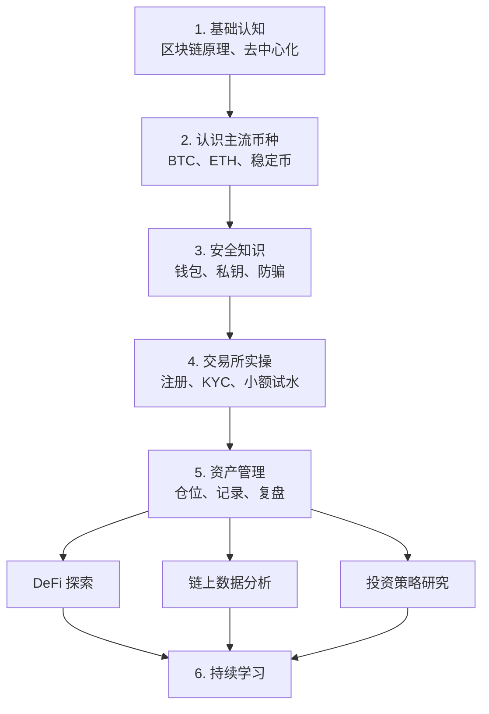

# 学习路线与进度

核对日期：2026-08-30

## 路线总览

## 状态

- [x] 阶段 1：基础认知（完成状态来自项目所有者；历史内容见 [`../QA.txt`](../QA.txt)）
- [ ] 阶段 2：认识主流币种（当前阶段，见 [`stage-02-mainstream-assets.md`](stage-02-mainstream-assets.md)）
- [ ] 阶段 3：安全知识（计划已创建，见 [`stage-03-wallet-security.md`](stage-03-wallet-security.md)）
- [ ] 阶段 4：交易所实操
- [ ] 阶段 5：资产管理
- [ ] 阶段 6：选择进阶方向并建立持续学习机制

## 各阶段通关标准

### 阶段 1：基础认知

能用自己的话解释分布式账本、哈希链、共识机制、公私钥，以及 coin 与 token 的区别。能回答“为什么历史记录难以篡改”和“私钥丢失为什么无法由中心机构找回”。

### 阶段 2：认识主流币种

能从用途、共识、交易模型、供给/发行、费用、信任假设和主要风险七个维度比较 BTC、ETH 与稳定币；能只读分析一笔 BTC 交易和一笔 ETH 交易；能解释“稳定币稳定不等于无风险”。详细标准见第二阶段课程的“结业验收”。

### 阶段 3：安全知识

能区分托管与自托管、热钱包与冷钱包、私钥与助记词；完成离线备份方案和钓鱼识别清单；通过签名前安全门后，在不暴露秘密的隔离环境中使用测试网完成收发与恢复演练。详细标准见[第三阶段计划](stage-03-wallet-security.md)的“最终退出标准”。

### 阶段 4：交易所实操

先完成所在司法辖区的合规性、费用和安全记录调查，再以可承受损失的小额资金走通法币入金、现货交易、提现和记录流程。禁止杠杆与借贷作为通关条件。

### 阶段 5：资产管理

写出风险预算、仓位上限、再平衡规则和退出条件；连续记录并复盘，不用短期收益判断学习是否成功。

### 阶段 6：进阶与持续学习

从 DeFi、链上数据或策略研究中选择一个方向，完成一个可复现的小项目，并建立来源清单、事实核验和月度复盘流程。

## 进度更新规则

- “材料已创建”不等于“阶段已完成”。
- 只有完成课程输出、测验和通关标准后，才能勾选阶段。
- 每次更新状态时，在 [`learning-log.md`](learning-log.md) 留下日期、证据和仍未解决的问题。
